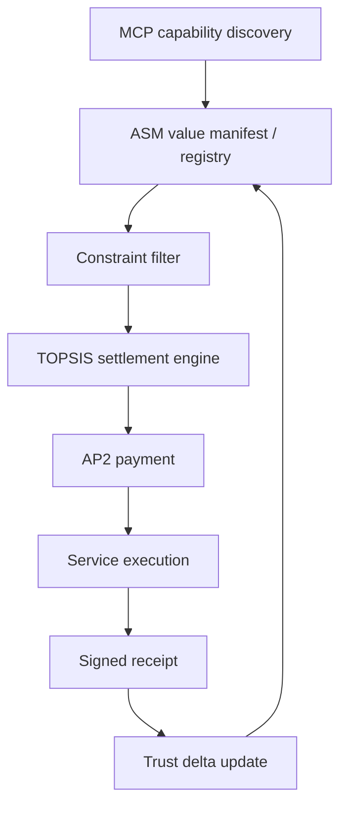

# Agent Service Manifest: A Settlement Protocol for Value-Aware Tool Selection in Agent Economies

> **Draft — Complete (Sections 1-8), Revision 3 (tool-selection reframing)**
> Authors: Yi Guo
> Date: June 2026

---

## Abstract

Autonomous agents increasingly act on a human's behalf, and to do so they must choose among heterogeneous tools: GUI applications, CLIs, and APIs; free and paid; cloud-hosted and local-only. Existing protocols cover capability discovery (MCP), inter-agent communication (A2A), and payment execution (AP2), but the selection layer is missing twice over: an agent can see what a tool does, yet can compute neither *whether it can use it* — invocability from its runtime, permitted automation, unattended setup — nor *what it is worth* — price, quality, reliability, data terms. We present **Agent Service Manifest (ASM)**, a lightweight settlement protocol: a JSON Schema giving agents standardised eligibility and value descriptors across invocation, usage terms, data governance, pricing, quality, SLA, provenance, verification, and payment. Selection proceeds as eligibility gating followed by preference-weighted multi-criteria ranking (constraint filter + TOPSIS). Two audits ground the gap: 0/50 MCP-related GitHub repositories and 0/14,519 entries across five MCP registries and directories (including the full MCPCorpus dataset) expose all four core value classes simultaneously. We validate the **value layer in depth** on the AI-service slice — **75 manifests across 47 taxonomies**; on 200 synthetic tasks ASM improves preference-weighted utility by **23.1%** over random and cuts cost **59.2%** vs. most-expensive ($p < 10^{-6}$, < 5 ms scoring overhead); across three frontier LLMs (DeepSeek-V4-flash, Qwen3-Max, Kimi K2.5), swapping raw HTML for ASM manifests raises top-1 selection accuracy from **63.9-72.2% to 100.0%** with non-overlapping 95% CIs; a live-execution follow-up over 30 real tasks exposes the protocol's quality-normalisation limitation in the wild. We then validate the **eligibility layer in breadth** with a curated tool-value library of **30 real products across 7 task domains** (task management, design, research, communication, developer tools, booking, real-estate data), where the selected tool changes correctly with the agent's runtime, the task's capability requirements, and operational risk — a flight-booking task returns `risk=critical, approval required` before any call is made. The strongest external evidence is a **production co-design loop**: after a first reference integration (Akkhar-Code receipts, shipped via an open RFC-to-PR-to-merge process), the operator of an 810-pack MCP gateway ran the selector, identified the missing signal — distinguishing tools an agent can use immediately from tools whose onboarding requires a human — and that signal shipped the same day as first-class schema fields (`agent_completable_setup`, `setup_requires`), followed by an inline-vs-link mutability convention drawn from the same operator's feedback. ASM rides MCP Server Cards as a `_meta` "rider" extension alongside two independent riders (payment, project context), and ships five distribution surfaces, including a live hosted selector. ASM's honest caveat is unchanged: the protocol inherits the data quality of the manifests it is fed; library coverage is curated, and gaps are documented rather than fabricated.

---

## 1. Introduction

The agent economy is undergoing a fundamental transformation. When a user asks an agent to "make me a study plan and remind me daily," the agent must select and *operate* real products to deliver: a task manager to hold the plan, a reminder mechanism to fire daily, perhaps a pomodoro timer. The candidates are radically heterogeneous — some expose clean cloud APIs, some are drivable only by on-device automation, some are GUI-only and cannot be driven at all; some are free, some need a paid subscription or a user-supplied API key; some permit automated use and some forbid it in their terms. The same structure repeats across everything agents are asked to do — booking travel, sending team updates, editing images, opening pull requests, pulling property data — and a single workflow may require such selection decisions across multiple categories, each with distinct invocation surfaces, pricing structures, quality profiles, and operational risk. AI services (language models, image generation, speech synthesis) are one slice of this space, and the slice where structured value data is deepest; but the selection problem an agent actually faces is the general one: *which tool, of the ones I can use and am allowed to use, best fits this task at what cost and risk?*

This transformation has been supported by significant advances in agent infrastructure protocols. The **Model Context Protocol** (MCP) [1], introduced by Anthropic and now supported by major platforms including OpenAI and Google, provides a standardized mechanism for agents to discover and invoke external tools. Google's **Agent-to-Agent Protocol** (A2A) [2] enables structured communication between agents, while the **Agent Payment Protocol** (AP2) [3] defines secure transaction execution for agent-initiated purchases. Together, these protocols address the fundamental questions of *what tools can do*, *how agents communicate*, and *how to pay safely*.

However, a critical gap remains — and it is double. **No existing protocol tells an agent whether it can use a tool, and no existing protocol tells it what the tool is worth.** The first half is the eligibility question: can this agent, from its runtime (a headless cloud process vs. an agent resident on the user's device), drive this tool at all? Is automated use permitted by the terms of service? Can the agent get from zero to a working call without a human completing a signup, a payment, or an OAuth consent? The second half is the value question: among the eligible candidates, which is worth selecting on price, quality, reliability, and data terms? Connection-layer protocols and integration platforms (MCP and Server Cards, Zapier's 8,000+ connectors, Composio's 850+) answer *how to connect*; none answers *which of several to pick*.

When an agent faces three subtitle generation APIs priced at $0.10/minute, $0.03/minute, and free (with a 5-minute queue), it possesses no structured data to make an informed choice. The pricing information exists only in human-readable HTML pages with inconsistent formats. Quality data is scattered across blog posts, social media discussions, and vendor marketing materials. SLA parameters — latency percentiles, uptime guarantees, rate limits — are buried in documentation that varies wildly in structure and completeness. The result is that **agent intelligence drops to zero at the selection step**: regardless of how capable the underlying model is, it cannot optimize over information it cannot parse.

This is not just an efficiency problem — it is a **reproducibility problem**. Two agents asked the same selection question on the same day cannot in general arrive at the same answer, because the data they are reasoning over (HTML pricing pages, blog posts, marketing copy) is unstructured, time-varying, and provider-controlled. An autonomous coding agent (e.g., Claude Code, Cursor) that must invoke an LLM, generate an image, and run code on a GPU within one workflow is making three selection decisions over three independent webs of unstructured documentation. We show in §6.7 that even when the same frontier LLM (DeepSeek-V4-flash, Qwen3-Max, Kimi K2.5) makes those decisions over the same provider URLs, top-1 selection accuracy on a 36-task ranking suite is only 63.9–72.2%, against ground truth derived from the same pages' published numbers. The same task with structured ASM manifests reaches 100% across all three LLMs. The cost differences in §6.5 (a "more expensive = better" baseline pays **2.4× the cost** of ASM-guided selection over 200 multi-category tasks) follow from the same structural gap: when an agent cannot compare services on a common axis, even strong models default to defensible heuristics that are systematically wrong on user preference vectors.

We argue that the root cause is not insufficient model intelligence but **missing data infrastructure**. Just as the Nutrition Facts label transformed consumer food purchasing from subjective judgment to informed comparison, AI services need a standardized, machine-readable "value label" that makes their economic properties computable.

We summarize this design goal as: *"Agents shouldn't shop. They should settle."* That is, an agent confronted with a candidate set should not enter an open-ended evaluation loop — fetching pages, parsing free-form text, and inferring trade-offs — but should reach a *settled* decision in a single, deterministic step over structured data. ASM is the substrate that makes settlement, rather than shopping, the default operating mode.

To test whether this gap exists in current practice rather than only in theory, we run two complementary audits. The first samples 50 public repositories returned by four MCP-related GitHub queries; the second extends to 14,519 entries across five MCP registries and directories — the official MCP registry, Glama, MCP Atlas, FindMCP, and the full MCPCorpus public dataset. Across both, no entry exposes all four core value classes (pricing, SLA, quality, payment) in machine-actionable form. ASM is therefore positioned as a response to a measurable, ecosystem-scale missing layer — not as a competing alternative to MCP, but as the value-metadata layer MCP and adjacent registries leave room for.

In this paper, we present **Agent Service Manifest (ASM)**, an open settlement protocol designed to fill this gap. ASM provides:

1. **A standardized eligibility + value descriptor** — a JSON Schema specification covering, on the eligibility side, invocation (interface, cloud/local reach, agent operability, and whether setup is completable without a human — `agent_completable_setup` / `setup_requires`), usage terms (whether automated use is permitted at all), and data governance (ownership, export, training-use, retention); and, on the value side, pricing (open billing dimensions with tiered and conditional pricing), quality (third-party benchmark references with trust transparency), SLA (latency, throughput, uptime, rate limits), operational constraints (risk class, side effects, approval boundaries), provenance, and payment methods (pre-wired for AP2 interop).

2. **An extensible hierarchical taxonomy** — a classification system (e.g., `ai.llm.chat`, `ai.vision.image_generation`, `infra.compute.gpu`, `tool.devops.monitoring`, `tool.productivity.task_management`) that enables agents to search, filter, and match candidates across categories using prefix queries; 47 categories at the original corpus snapshot, since extended by an external integration and by the tool-value library without schema changes (§4.2).

3. **A gated selection engine** — eligibility gates (agent-operability, reach, terms, platform, capability fit, setup completability) applied before hard constraint filtering and TOPSIS (Technique for Order Preference by Similarity to Ideal Solution) multi-criteria ranking, producing preference-aware recommendations that carry the selected tool's risk class and approval requirement, with full explainability including per-candidate rejection reasons.

4. **An MCP-compatible integration path** — ASM can be deployed as an independent `.well-known/asm` endpoint (Phase 1), embedded today in MCP Registry `server.json` under `_meta.io.modelcontextprotocol.registry/publisher-provided.asm` (Phase 2), or carried as a `_meta` "rider" extension on MCP Server Cards alongside independent riders for payment and project context (Phase 3, in progress on the Extensions track), ensuring zero breaking changes at each stage. A mutability convention governs the embed: inline blocks carry static facts; mutable value data (pricing, SLA, quality) lives behind `asm_url` so freshness has a single re-stampable source.

5. **A curated tool-value library and selector** — 30 real products across 7 task domains, each entry source-linked and schema-validated, with unverified dimensions documented rather than fabricated; distributed through five surfaces (importable module, CLI, MCP server, hosted HTTP API, LangChain tool) so agent builders can consume selection decisions without adopting the schema.

We validate ASM at two depths. **In depth**, on the AI-service slice: **75 real-world service manifests spanning 47 taxonomies**, all carrying explicit provenance metadata, with two ecosystem audits (n=50 GitHub repositories and n=14,519 registry / directory entries) showing that structured value metadata is absent in current practice. A 200-task A/B evaluation, a 7-baseline regret analysis, a 20-request natural-language preference-alignment suite, a three-LLM ranking experiment, a live-execution follow-up, and external Arena/OpenRouter stress tests converge on the same finding: when value metadata is structured and semantically comparable, selection becomes deterministic and cross-LLM-stable; when it is not, even frontier LLMs leave 28-36 percentage points of top-1 accuracy on the table or propagate bad benchmark assumptions. **In breadth**, on the general tool-selection problem: a curated library of 30 real products across 7 task domains, where eligibility gates (cloud vs. local-only reach, GUI-only tools, aggregator-only access, human-in-the-loop setup) change the selected tool correctly as the agent's runtime and the task's requirements change, and where high-stakes domains surface `risk_class` and approval requirements before any call is made (§6.5d). The eligibility layer's key field was named by a production gateway operator running the selector against an 810-pack catalog, and shipped the same day (§6.5e). Our framing throughout this paper is therefore not "ASM is faster or cheaper than X"; it is **"without structured eligibility and value metadata, agent tool selection is not reproducible - and ASM is a runnable, reproducible, integrable layer that fixes this".**

The remainder of this paper is organized as follows. Section 2 formalizes the tool selection problem. Section 3 surveys related work. Section 4 presents the ASM protocol design. Section 5 describes the reference implementation. Section 6 evaluates ASM across multiple scenarios. Section 7 discusses limitations, trust mechanisms, and future directions. Section 8 concludes.

---

## 2. Problem Formulation

### 2.1 Setting

We consider a setting where an autonomous agent $\mathcal{A}$, running in an execution environment $E$ (cloud-hosted or resident on the user's device, on a given platform, holding a given set of credentials), receives a task $T$ from a user $U$ and must select one or more tools from a candidate set $\mathcal{S} = \{s_1, s_2, \ldots, s_n\}$ to fulfill the task. Each tool $s_i$ is characterized by an eligibility descriptor and a value vector:

$$\mathbf{g}_i = (\text{op}_i, \text{reach}_i, \text{terms}_i, \text{plat}_i, \text{setup}_i, F_i) \qquad \mathbf{v}_i = (c_i, q_i, l_i, r_i, \mathbf{e}_i)$$

where the eligibility descriptor declares:
- $\text{op}_i \in \{0,1\}$ — whether an autonomous agent can drive the tool at all (a GUI-only application is $\text{op}_i = 0$)
- $\text{reach}_i \in \{\text{cloud}, \text{local\_device}, \text{hybrid}\}$ — where an agent must run to drive it
- $\text{terms}_i$ — whether automated use is permitted by the provider's terms
- $\text{plat}_i$ — supported platforms
- $\text{setup}_i \in \{0,1\}$ — whether an agent can get from zero to a working call with no human-in-the-loop step (paid signup, OAuth consent, manual approval)
- $F_i$ — the set of concrete capabilities the tool offers

and the value vector declares:
- $c_i \in \mathbb{R}_{\geq 0}$ is the cost (normalized to a per-unit basis)
- $q_i \in [0, 1]$ is the quality score (normalized from heterogeneous benchmarks)
- $l_i \in \mathbb{R}_{> 0}$ is the latency (p50, in seconds)
- $r_i \in [0, 1]$ is the reliability (uptime probability)
- $\mathbf{e}_i$ is a vector of category-specific extension attributes

### 2.2 User Preferences

The user specifies preferences through two mechanisms:

**Hard constraints** $\mathcal{C}$: A set of inequality predicates that candidates must satisfy to be considered. For example:

$$\mathcal{C} = \{q_i \geq 0.8, \; l_i \leq 5.0, \; c_i \leq 0.10\}$$

Services violating any constraint are eliminated from the candidate set.

**Soft preferences** $\mathbf{w}$: A weight vector $\mathbf{w} = (w_c, w_q, w_l, w_r)$ where $\sum w_j = 1$ and $w_j \geq 0$, representing the relative importance of each dimension.

### 2.3 Selection Problem

Selection is a two-phase decision. First, **eligibility gating** eliminates tools the agent cannot or may not use, regardless of how attractive their value vectors are:

$$\mathcal{S}_{\text{elig}} = \{s_i \in \mathcal{S} \mid G(\mathbf{g}_i, E, T) = 1\}$$

where $G$ requires $\text{op}_i = 1$, $\text{reach}_i$ compatible with the agent's environment $E$, automated use permitted by $\text{terms}_i$, platform compatibility, the task's required capabilities $F_T \subseteq F_i$, and — when the agent operates unattended — $\text{setup}_i = 1$. The gate order matters: these are lexicographic vetoes, not weighted criteria; no price discount compensates for a tool the agent cannot drive.

Second, the agent finds the tool $s^*$ that maximizes a preference-weighted multi-criteria score over the feasible set:

$$s^* = \arg\max_{s_i \in \mathcal{S}_{\text{feas}}} \; f(\mathbf{v}_i, \mathbf{w})$$

where $\mathcal{S}_{\text{feas}} = \{s_i \in \mathcal{S}_{\text{elig}} \mid s_i \text{ satisfies } \mathcal{C}\}$ is the set of eligible tools passing all hard constraints, and $f$ is a scoring function that maps value vectors and preference weights to a scalar ranking score. The decision additionally carries the selected tool's operational policy (risk class, side effects, approval requirement) so the caller can gate execution.

### 2.4 Key Challenges

This formulation reveals several challenges that motivate ASM:

**C1: Heterogeneous pricing.** Real-world AI services use at least 8 distinct billing models — per-input-token, per-output-token, per-image, per-second-of-video, per-character, per-GPU-second, per-request, and subscription-with-credits. A single LLM may bill for both input and output tokens at different rates, with conditional pricing when context exceeds a threshold. Converting these into comparable per-unit costs requires a standardized schema with explicit billing dimension declarations.

**C2: Incommensurable quality.** Quality metrics vary by category: LLMs use Elo scores (LMSYS Arena), image generators use FID (lower is better), TTS systems use MOS (1–5 scale). There is no universal quality score. ASM addresses this by preserving the original metric and scale in the manifest, with normalization performed at scoring time.

**C3: Non-structured information.** Currently, pricing, quality, and SLA data exists primarily in human-readable formats (HTML pricing pages, blog posts, API documentation). LLM-based extraction from these sources is probabilistic, non-reproducible, and costly at scale. For an agent comparing 100 services, reading 300+ web pages would consume thousands of tokens per selection — a cost that dwarfs the savings from better selection.

**C4: Trust asymmetry.** Service providers have economic incentives to overstate quality and understate latency. Without a verification mechanism, agents cannot distinguish self-reported claims from independently verified measurements.

**C5: Preference diversity.** The optimal service depends entirely on who is asking. A user prioritizing cost will choose differently from one prioritizing quality, even when facing the identical candidate set. This rules out any "one size fits all" ranking and necessitates a parameterized scoring function.

**C6: Invocability heterogeneity.** Real tools differ not only in value but in whether an agent can use them at all, and the differences are messier than an API/CLI/GUI ladder. A tool may expose a clean cloud API (Todoist), be drivable only by on-device automation (Things 3 via AppleScript — unreachable for a cloud agent), be reachable only through an aggregator (Any.do via Zapier), or be GUI-only with no automation surface (Affinity Designer, Procreate). Orthogonally, a tool may *technically* accept credentials yet still be unusable unattended because onboarding requires a human: a paid signup (ATTOM), an OAuth consent, or a licensing approval (MLS-class data via the RESO Web API). These properties are hard vetoes, not scoring penalties — which is why ASM models them as a first-class eligibility descriptor rather than folding them into the value vector.

### 2.5 Relationship to LLM Routing

It is important to distinguish the ASM selection problem from **LLM routing** as studied in RouteLLM [4] and related work [5]. LLM routing operates *within a single category* (e.g., choosing between GPT-4 and Mixtral for a given query based on predicted difficulty), using ML models trained on preference data. ASM operates *across categories and providers* (e.g., choosing between an LLM service, an image generation service, and a GPU compute service), using structured metadata rather than learned routers. The two are complementary: ASM selects the category and provider, then a system like RouteLLM can further optimize the specific model within that provider.

---

## 3. Related Work

### 3.1 Agent Communication Protocols

The agent protocol landscape has been systematically surveyed by [6], who propose a two-dimensional taxonomy: Context-Oriented (connecting agents to tools/data) versus Inter-Agent (connecting agents to each other), crossed with General-Purpose versus Domain-Specific. MCP [1] occupies the Context-Oriented × General-Purpose quadrant, providing standardized tool discovery and invocation. A2A [2] addresses Inter-Agent communication. The Agent Communication Protocol (ACP) and Agent Network Protocol (ANP) extend these to additional settings.

Critically, this taxonomy has no dimension for **service economics** — none of the surveyed protocols address pricing, quality comparison, or value-based selection. ASM introduces a third dimension to this framework: the Service Economics layer that makes value computable alongside capability and communication.

### 3.2 Agent-as-a-Service

The most closely related academic work is **AaaS-AN** (Agent-as-a-Service based on Agent Network) [7], which proposes a service-oriented agent paradigm based on the RGPS (Role-Goal-Process-Service) standard. AaaS-AN defines a dynamic agent network with service discovery, registration, and orchestration capabilities, validated at the scale of 100+ agent services.

While AaaS-AN and ASM both touch service discovery, their focus is fundamentally different:

| Dimension | AaaS-AN | ASM |
|-----------|---------|-----|
| Core problem | How agents organize and collaborate | How agents evaluate and select services |
| Service discovery | "Who can collaborate" | "Who offers the best value" |
| Pricing support | None | Open billing dimensions + tiered/conditional |
| Quality metrics | None | Third-party benchmarks + trust flags |
| SLA | None | Latency, throughput, uptime, rate limits |
| Scoring function | None | Filter + TOPSIS with user preferences |

The two are complementary: AaaS-AN orchestrates the agent team, and ASM optimizes each team member's purchasing decisions.

### 3.3 LLM Routing

**RouteLLM** [4] (LMSYS, 4.8K GitHub stars) introduces learned routers that dynamically select between strong and weak LLMs based on query difficulty, achieving 85% cost reduction while maintaining 95% of GPT-4 performance. Four router architectures are evaluated: matrix factorization (recommended), weighted Elo, BERT classifier, and LLM-as-judge.

The **Dynamic Model Routing and Cascading Survey** [5] provides a comprehensive taxonomy of LLM routing approaches, categorizing them by decision timing (pre-routing, mid-generation, post-generation), information used (query features, model metadata, historical performance), and optimization objective (cost, quality, latency).

ASM and LLM routing are complementary systems operating at different levels:

| Dimension | LLM Routing | ASM |
|-----------|-------------|-----|
| Decision timing | Runtime (per-request) | Selection time (per-task) |
| Input data | Query content/difficulty | Structured service metadata |
| Scope | Single category (LLMs only) | Cross-category |
| Method | ML models (trained on preference data) | Mathematical optimization (no training) |
| Complementarity | Optimizes *within* a provider | Optimizes *across* providers and categories |

A complete agent service stack would use ASM to select the category and provider, then RouteLLM (where applicable) to select the specific model.

### 3.4 Secure Payment and Trust

**AP2** (Agent Payment Protocol) [3] by Google defines how agents securely execute payments using Verifiable Digital Credentials (VDCs), Intent Mandates for pre-authorization, and role-separated architecture (user / shopping agent / credential provider / merchant / payment processor). AP2 solves *how to pay* but not *what to buy*.

**Agent Receipts** [8] provides cryptographically signed execution records following the W3C Verifiable Credentials standard, creating an immutable audit trail of agent actions. The ASM-Receipts interoperation forms a complete trust chain: ASM declares expected service quality (pre-selection), the service executes, and a signed receipt records actual delivery (post-execution). Comparing declared vs. actual yields a dynamic trust score:

$$\text{trust}(s_i) = g\left(\sum_{t=1}^{N} \| \mathbf{v}_i^{\text{declared}} - \mathbf{v}_i^{(t), \text{actual}} \| \right)$$

where $g$ is a monotonically decreasing function and $N$ is the number of past transactions.

**Cao et al.** (WWW 2026) proposed agent-side reputation graphs for service selection, where agents collectively maintain reputation scores based on observed execution outcomes. ASM differs by emitting structured receipts at the protocol layer rather than relying on distributed agent-side observation collection; this design choice keeps verification provider-centric (the service signs its own receipts) rather than community-dependent, reducing coordination overhead at the cost of requiring provider participation.

### 3.5 MCP Ecosystem

The MCP ecosystem has been analyzed from a security perspective by [9], who identify 4 attacker types and 16 threat scenarios across the MCP lifecycle. Their analysis of trust boundaries is directly relevant to ASM: the `self_reported` flag in ASM manifests addresses the same "trusted vs. untrusted server" distinction that MCP's ToolAnnotations acknowledges with its "hints should not be trusted" caveat.

The **MCP 2026 Roadmap** [10] prioritizes transport evolution, agentic communication, governance maturity, and enterprise readiness — but contains **no mention of pricing, marketplace, or service economics**. This confirms that ASM addresses a gap the MCP team has not planned to fill at the time of writing.

Concurrently, **AWS has released a Marketplace MCP Server** [11] that enables agent-driven product discovery, comparison, and procurement within the AWS Marketplace. This validates the demand for agent-automated service evaluation but implements it as a closed, platform-locked solution. ASM provides the same capability as an open, vendor-neutral standard.

The closest MCP-native development is **Server Cards** (SEP-2127, now incubating on MCP's Extensions track) [18]: structured metadata documents served at a well-known path that let clients discover a server's capabilities, transports, and authentication requirements before connecting. Server Cards answer *how to connect*; they deliberately exclude the economic and eligibility metadata an agent needs to *choose among* several capable servers. The card's reverse-DNS `_meta` field has emerged as the extension surface for such adjacent concerns: at the time of writing, three independent "rider" extensions carry payment, project context, and — via ASM — value/selection metadata on this surface, and a production multi-server host serving 810 packs has documented the pattern from the operator's seat [17]. ASM is positioned as the selection rider on this surface, not a competing discovery mechanism (§6.5e).

### 3.6 Multi-Criteria Decision Making

ASM's scoring engine draws on the rich MCDM (Multi-Criteria Decision Making) literature, particularly its application to cloud service selection [12]. We adopt **TOPSIS** [13] (Technique for Order Preference by Similarity to Ideal Solution) as our primary ranking method due to its mathematical soundness, computational efficiency, and wide acceptance in the service selection literature. TOPSIS simultaneously considers distance to the positive ideal solution (best possible) and negative ideal solution (worst possible), producing more robust rankings than simple weighted averages that can be skewed by extreme values in a single dimension.

---

## 4. Protocol Design

This section presents the ASM protocol specification: the manifest schema (§4.1), the hierarchical taxonomy (§4.2), the pricing engine (§4.3), the quality and trust model (§4.4), and the integration architecture with MCP and Signed Receipts (§4.5).

### 4.1 Manifest Schema

An ASM manifest is a JSON document conforming to JSON Schema Draft 2020-12. The design follows a **minimal core, maximal optional** philosophy: only three fields are required, while rich optional modules allow progressive disclosure of service value.

**Required fields:**

| Field | Type | Description |
|-------|------|-------------|
| `asm_version` | `string` (const) | Protocol version (`"0.3"`) |
| `service_id` | `string` | Globally unique identifier. Format: `<provider>/<service>@<version>` |
| `taxonomy` | `string` | Standardized category (see §4.2) |

This means the simplest valid ASM manifest is just 3 lines of JSON — a deliberately low barrier to adoption.

**Optional modules:**

| Module | Purpose | Key Fields |
|--------|---------|------------|
| `invocation` | Eligibility: can an agent drive it, from where | `interface`, `reach` (cloud / local_device / hybrid), `agent_operable`, `auth_to_invoke`, `agent_completable_setup`, `setup_requires[]`, `automation_paths[]`, `platforms[]` |
| `usage_terms` | Eligibility: is automated use permitted | `automation_allowed` (yes / conditional / no / unknown), `tos_url`, `license` |
| `data_governance` | Consequences of use | `data_owner`, `exportable`, `trains_on_user_data` (yes / opt_out / no / unknown), `retention`, `residency[]`, `lock_in_notes` |
| `capabilities` | Task fit | `functions[]` (concrete capabilities for requirement matching), modalities, limits |
| `operational_constraints` | Pre-call policy envelope | `risk_class`, `side_effects[]`, `approval` (never / conditional / always), `spend_caps`, `quotas`, `rate_limits` |
| `pricing` | Cost structure | open `billing_dimensions[]`, `tiers`, `conditions`, `batch_discount`, `free_tier` |
| `quality` | Performance metrics | `metrics[]` (name, score, scale, benchmark, `self_reported`), `leaderboard_rank` |
| `sla` | Reliability guarantees | `latency_p50`, `latency_p99`, `throughput`, `uptime`, `rate_limit`, `regions` |
| `payment` | Payment methods | `methods[]`, `auth_type`, `ap2_endpoint` |
| `provenance` | Source traceability | `source_url`, `retrieved_at`, `last_verified_at`, `verification_status`, `notes` |
| `extensions` | Category-specific | Namespaced fields (e.g., `llm.supports_vision`, `image_gen.max_resolution`) |

The first three modules form the **eligibility descriptor** ($\mathbf{g}_i$ in §2.1) and were added when the protocol's scope generalised from AI services to arbitrary tools; all are optional and backward compatible (every pre-existing manifest continues to validate). Two design points deserve note. First, `agent_completable_setup` and `setup_requires` encode the distinction between a tool that is *immediately usable* and one that *technically accepts credentials* but still needs a human to complete a paid signup, an OAuth consent, or a manual approval — a signal named by a production gateway operator after running the selector (§6.5e), and added the same day. Second, `usage_terms` is deliberately independent of `invocation`: a tool may expose a clean API yet forbid automated use, or be GUI-only yet explicitly bless scripting; technical reachability and permission are different gates.

**v0.3 additions** (for Signed Receipts integration):

| Field | Type | Description |
|-------|------|-------------|
| `updated_at` | `date-time` | ISO 8601 timestamp of last manifest update |
| `ttl` | `integer` | Cache time-to-live in seconds (default: 3600) |
| `receipt_endpoint` | `uri` | Endpoint for obtaining signed receipts post-execution |
| `verification` | `object` | Verification config: `protocol`, `public_key`/`public_key_url`, `receipt_schema_version` |

The `updated_at` + `ttl` pair solves the **manifest freshness problem**: agents can determine when data was last refreshed and when to re-fetch, avoiding stale pricing or quality data.

### 4.2 Hierarchical Taxonomy

ASM defines an extensible hierarchical taxonomy — 47 categories at the original corpus snapshot — using a dot-separated format: `<domain>.<category>[.<subcategory>]`. This enables prefix-based queries — an agent searching for `ai.llm.*` retrieves all LLM services regardless of subcategory. The taxonomy spans three top-level domains: AI/ML services (`ai.*`), infrastructure (`infra.*`), and developer/productivity tooling (`tool.*`):

```
ai.llm.chat                      ai.audio.tts                    tool.communication.email
ai.llm.completion                ai.audio.stt                    tool.communication.sms
ai.llm.embedding                 ai.audio.music                  tool.data.search
ai.vision.image_generation       ai.code.generation              tool.data.scraping
ai.vision.image_editing          ai.data.extraction              tool.data.pdf
ai.vision.ocr                    ai.translation                  tool.data.visualization
ai.video.generation              ai.weather                      tool.devops.ci
ai.video.subtitle                infra.compute.gpu               tool.devops.monitoring
ai.video.editing                 infra.compute.serverless        tool.devops.deployment
infra.storage.object             infra.storage.vector            tool.productivity.calendar
infra.database.serverless        infra.database.cache            tool.productivity.document
infra.auth.identity              infra.dns                       tool.productivity.spreadsheet
infra.secrets                    infra.observability.error       tool.productivity.todo
tool.payment.processing          tool.communication.messaging    tool.productivity.knowledge
... (47 categories total)
```

The taxonomy is validated by a regex pattern: `^[a-z]+\.[a-z_]+(?:\.[a-z_]+)?$`. This ensures machine-parseable, collision-free category identifiers while remaining human-readable. The set is deliberately open and has grown in practice without schema changes: the external integration of §6.5c contributed `tool.code.orchestration` as the 48th leaf, and the tool-value library (§6.5d) extends the `tool.*` domain with task-domain leaves such as `tool.productivity.task_management`, `tool.creative.design`, `tool.booking.travel`, and `tool.data.real_estate` — all validating against the same pattern.

**Design rationale.** We chose a flat-with-hierarchy approach over ontological classification (e.g., OWL) for three reasons: (1) agents need fast prefix matching, not inference; (2) the taxonomy must be extensible without breaking existing manifests; (3) simplicity maximizes adoption — a provider can assign a taxonomy in seconds.

### 4.3 Pricing Engine

Real-world AI service pricing exhibits significant heterogeneity (Challenge C1 from §2.4). ASM addresses this with a multi-dimensional pricing model:

**Billing dimensions.** A single service can declare multiple billing dimensions. For example, an LLM charges separately for input and output tokens:

```json
{
  "billing_dimensions": [
    { "dimension": "input_token",  "unit": "per_1M", "cost_per_unit": 3.00,  "currency": "USD" },
    { "dimension": "output_token", "unit": "per_1M", "cost_per_unit": 15.00, "currency": "USD" }
  ]
}
```

ASM recommends common dimension identifiers such as `input_token`, `output_token`, `token`, `character`, `word`, `image`, `pixel`, `second`, `minute`, `request`, `gpu_second`, `byte`, `query`, and `custom`, while allowing domain-specific dimensions such as `browser_minute`, `email`, `ci_minute`, or `api_call`. The `unit` field similarly recommends `per_1`, `per_1K`, and `per_1M` while allowing service-specific units such as `per_page`, `per_message`, or `per_1_gb_month`.

**Tiered pricing.** Volume discounts are expressed as tier arrays:

```json
{
  "tiers": [
    { "up_to": 1000000, "cost_per_unit": 3.00 },
    { "up_to": 10000000, "cost_per_unit": 2.50 },
    { "up_to": "unlimited", "cost_per_unit": 2.00 }
  ]
}
```

**Conditional pricing.** Context-dependent pricing (e.g., LLM pricing that doubles when context exceeds 200K tokens) is expressed as:

```json
{
  "conditions": { "when": "context_tokens > 200000", "cost_per_unit": 6.00 }
}
```

**Cost normalization.** For scoring purposes, multi-dimensional pricing is reduced to a single representative cost. For LLMs with input/output token pricing, we use a weighted estimate parameterized by the input-output ratio $\rho$:

$$c_{\text{repr}}(\rho) = (1 - \rho) \cdot c_{\text{input}} + \rho \cdot c_{\text{output}}$$

The default value $\rho = 0.7$ reflects empirical observation that conversational LLM responses are typically 2–3× longer than prompts. The reference implementation exposes $\rho$ as the `io_ratio` parameter, with three documented presets: $\rho = 0.3$ for retrieval-heavy / RAG workloads (long prompts, short answers), $\rho = 0.5$ for balanced workloads, and $\rho = 0.8$ for long-form generation. Making this ratio explicit avoids burying a workload assumption inside the protocol; agents that know their access pattern can calibrate cost ranking accordingly. For single-dimension services, the primary billing dimension is used directly.

### 4.4 Quality and Trust Model

ASM implements a three-layer trust architecture that addresses the trust asymmetry challenge (C4):

**Layer 1: Source Transparency.** Every quality metric carries a `self_reported` boolean flag. When `self_reported: true`, the metric is a provider's own claim; when `false`, it references an independent benchmark. This simple binary flag enables agents to apply differential weighting — for example, discounting self-reported claims by 20%.

**Layer 2: External Verification.** Quality metrics reference public benchmarks with structured metadata:

```json
{
  "name": "LMSYS_Elo",
  "score": 1290,
  "scale": "Elo",
  "benchmark": "LMSYS Chatbot Arena",
  "benchmark_url": "https://chat.lmsys.org/?leaderboard",
  "evaluated_at": "2026-03-15",
  "self_reported": false
}
```

The `benchmark_url` and `evaluated_at` fields make claims independently verifiable — an agent (or auditor) can check the source.

**Layer 3: Signed Receipts Integration.** The most novel trust mechanism in ASM is its integration with cryptographically signed execution receipts. The trust chain operates as follows:

1. **Pre-selection**: ASM manifest declares expected service quality ($\mathbf{v}^{\text{declared}}$)
2. **Execution**: Agent invokes the service via MCP
3. **Post-execution**: Agent obtains a signed receipt from `receipt_endpoint`, recording actual delivery metrics ($\mathbf{v}^{\text{actual}}$)
4. **Trust update**: Agent computes trust delta and updates trust score

The **trust delta** for a single dimension is:

$$\delta(d, a) = \frac{|d - a|}{|d|}$$

where $d$ is the declared value and $a$ is the actual value. A delta of 0 indicates perfect accuracy; a delta of 1.25 indicates the actual latency was 125% worse than declared.

Trust scores are computed using **exponential decay weighting** over receipt history, ensuring that recent performance matters more than historical behavior:

$$w(t) = \exp\left(-\frac{\ln 2 \cdot \text{age}(t)}{\tau}\right)$$

where $\tau$ is the half-life (default: 1 week). The weighted trust score for dimension $j$ is:

$$\bar{\delta}_j = \frac{\sum_{t=1}^{N} w(t) \cdot \delta_j^{(t)}}{\sum_{t=1}^{N} w(t)}$$

The overall trust score combines all dimensions:

$$\text{trust}(s_i) = \max\left(0, \; 1 - \frac{1}{|J|}\sum_{j \in J} \bar{\delta}_j\right)$$

where $J = \{\text{cost}, \text{quality}, \text{latency}, \text{uptime}\}$.

**Confidence** increases asymptotically with the number of receipts:

$$\text{confidence}(n) = 1 - \exp(-n/5)$$

reaching 0.86 at 10 receipts and 0.98 at 20 receipts.

### 4.5 Integration Architecture



ASM is designed for progressive integration with the existing agent protocol stack, following a three-phase adoption path:

**Phase 1: Independent endpoint** (current). Services publish ASM manifests at `.well-known/asm` or in a shared registry. Agents query the registry via MCP tools. This requires no changes to MCP itself.

**Phase 2: MCP Registry `server.json` embedding**. ASM fields are embedded under the MCP Registry publisher-provided `_meta` namespace. This aligns with MCP's extension mechanism and allows registries, aggregators, and agents to consume ASM without requiring MCP hosts to understand it:

```json
{
  "name": "io.example/search",
  "_meta": {
    "io.modelcontextprotocol.registry/publisher-provided": {
      "asm": {
        "asm_version": "0.3",
        "service_id": "example/search@1.0",
        "taxonomy": "tool.data.search",
        "pricing": { "billing_dimensions": [{ "dimension": "query", "unit": "per_1K", "cost_per_unit": 2.5 }] },
        "sla": { "latency_p50": "650ms", "uptime": 0.995 }
      },
      "asm_url": "https://example.com/.well-known/asm"
    }
  }
}
```

**Phase 3: Native registry/specification field**. If adopted through a Specification Enhancement Proposal (SEP), ASM becomes a first-class value-metadata field in MCP registries or the MCP specification. The `_meta` representation remains backward-compatible for older hosts.

The **Signed Receipts integration** follows the W3C Verifiable Credentials data model. A receipt contains:

```json
{
  "@context": "https://www.w3.org/2018/credentials/v1",
  "type": ["VerifiableCredential", "ServiceExecutionReceipt"],
  "credentialSubject": {
    "asm:service_id": "anthropic/claude-sonnet-4@4.0",
    "asm:declared": { "latency_seconds": 0.8, "quality_score": 0.8167 },
    "asm:actual": { "latency_seconds": 0.82, "quality_score": 0.81 },
    "asm:trust_delta": { "latency": 0.025, "quality": 0.008 }
  },
  "proof": { "type": "Ed25519Signature2020", "proofValue": "z..." }
}
```

The `asm:` namespace is registered for receipt type fields, enabling full traceability from service selection through execution to verification.

---

## 5. Reference Implementation

We provide a complete reference implementation consisting of four components: a Python scoring engine (§5.1), a TypeScript MCP server (§5.2), demonstration scripts (§5.3), and the tool selector with its five distribution surfaces (§5.4). All components are open-source under the MIT license; the full suite passes 133 tests, including schema validation of every manifest and library entry.

### 5.1 Scoring Engine

The scoring engine (`scorer/scorer.py`, ~700 lines of pure Python with no external dependencies beyond the standard library and an optional `scipy` import for Welch's t-test) implements the three-stage selection pipeline. It exposes the `io_ratio` parameter described in §4.3, supports manifest filtering by hard constraints, and includes the trust-delta scoring described below:

**Stage 1: Constraint Filtering.** Hard constraints are evaluated as conjunction of inequality predicates. Services violating any constraint are eliminated:

```python
def filter_services(services, constraints):
    # Taxonomy prefix match, min_quality, max_cost,
    # max_latency_s, min_uptime
```

**Stage 2: Multi-Criteria Ranking.** Two scoring methods are implemented:

*Weighted Average* (v0.2): Min-max normalization followed by weighted sum. Cost and latency are inverted (lower = better). Simple and transparent, suitable for demonstrations.

*TOPSIS* (v1.0): The full TOPSIS algorithm as described in [13]:

1. Construct decision matrix $\mathbf{X} \in \mathbb{R}^{m \times 4}$ (services × criteria)
2. Vector-normalize: $r_{ij} = x_{ij} / \sqrt{\sum_i x_{ij}^2}$
3. Apply weights: $v_{ij} = w_j \cdot r_{ij}$
4. Identify positive ideal $A^+ = (\max_i v_{ij} \text{ for benefit}, \min_i v_{ij} \text{ for cost})$ and negative ideal $A^-$
5. Compute Euclidean distances: $d_i^+ = \|\mathbf{v}_i - A^+\|$, $d_i^- = \|\mathbf{v}_i - A^-\|$
6. Closeness coefficient: $C_i = d_i^- / (d_i^+ + d_i^-)$

TOPSIS produces more robust rankings than weighted averages because it simultaneously considers proximity to the best possible outcome and distance from the worst.

**Stage 3: Trust Delta Scoring** (v1.1): Computes trust scores from receipt history using exponential decay weighting (see §4.4). Trust-adjusted final scores are:

$$\text{score}_{\text{final}} = (1 - \alpha) \cdot \text{score}_{\text{TOPSIS}} + \alpha \cdot \text{trust} \cdot \text{confidence}$$

where $\alpha = 0.2$ by default. Services with high trust (accurate declarations) receive a boost; services with inflated claims are penalized.

**Manifest parsing.** The parser handles heterogeneous quality scales through automatic normalization:

| Scale | Normalization to [0, 1] |
|-------|------------------------|
| Elo (800–1400) | $(s - 800) / 600$ |
| 0–100 | $s / 100$ |
| 1–5 (MOS) | $(s - 1) / 4$ |
| Lower-is-better (FID) | $\max(1 - s/50, 0)$ |

This addresses Challenge C2 (incommensurable quality) by making all quality scores comparable at scoring time while preserving original values in the manifest.

### 5.2 Registry Server

The registry server (`registry/src/`, TypeScript) is dual-protocol: it speaks MCP over stdio for direct agent integration (`src/index.ts`) and HTTP/JSON for language-agnostic clients (`src/http.ts`, Express). Both surfaces share the same manifest store and scoring core, so an agent can connect over MCP while a dashboard, evaluator, or non-Claude language runtime queries the same service via REST. Six tools are exposed:

| Tool | Parameters | Description |
|------|-----------|-------------|
| `asm_list` | — | List all registered services |
| `asm_get` | `service_id` | Retrieve full manifest by ID |
| `asm_query` | `taxonomy`, `max_cost`, `min_quality`, `max_latency_s`, `input_modality`, `output_modality` | Multi-filter query |
| `asm_compare` | `service_ids[]` (2–5) | Side-by-side comparison table |
| `asm_score` | `taxonomy`, `w_cost`, `w_quality`, `w_speed`, `w_reliability` | Weighted scoring with ranking |
| `asm_taxonomies` | — | List available categories |

The server loads manifests from the `manifests/` directory at startup and exposes them through both the MCP stdio transport and an HTTP API. Any MCP-compatible client (Claude Desktop, Cursor, etc.) can connect over MCP, while an HTTP client can issue equivalent calls — for example `POST /api/score` — to obtain a ranked list with the same TOPSIS scoring logic.

**Architecture decision.** We implemented the MCP server in TypeScript (rather than Python) to match the MCP SDK's primary language and to demonstrate that ASM is language-agnostic — the schema is the contract, not the implementation.

### 5.3 Demonstration Scripts

Two demonstration scripts validate the end-to-end pipeline:

**E2E Demo** (`demo/e2e_demo.py`): Simulates 5 scenarios where an agent selects services across categories:

1. *Cost-first LLM selection* — budget chatbot
2. *Quality-first image generation* — product photography
3. *Quality-first TTS* — podcast voiceover
4. *Budget video generation* — social media clip
5. *Cross-category pipeline* — summarize video + generate thumbnail + add voiceover

Each scenario demonstrates that the same candidate set produces different optimal selections under different preference profiles.

**Signed Receipts Demo** (`demo/receipts_demo.py`): Demonstrates the trust delta pipeline:

1. Trust delta formula with worked examples
2. Exponential decay weight visualization
3. Full trust pipeline with honest vs. dishonest services (20 simulated receipts each)
4. Trust-adjusted re-ranking showing how dishonest services are penalized
5. ASM v0.3 manifest with receipt fields

### 5.4 Tool Selector and Distribution Surfaces

The tool selector (`library_select.py`, pure standard library) implements the gated selection of §2.3 over the library manifests: eligibility gates (agent-operability, reach vs. agent environment, terms, platform, required capabilities, optional `agent_completable_setup`), then cost-first ranking among survivors, returning a structured decision that includes the selected tool's `risk_class`, `approval_required`, `side_effects`, and per-candidate rejection reasons.

One engine is exposed through five surfaces, so agent builders consume selection decisions without adopting the schema:

| Surface | Entry point | Consumer |
|---------|-------------|----------|
| Importable module | `from library_select import select` | Python agents |
| CLI | `asm select "task" --taxonomy ... --json` | Scripts, humans |
| MCP server | `asm_selector_mcp.py` — `select_tool`, `list_library_tools`, `get_tool_manifest` | Claude Desktop, Cursor, MCP hosts |
| Hosted HTTP API | `POST /select` (stdlib-only; live public instance) | Any language, zero install |
| LangChain tool | `ASMToolSelectorTool` (langchain-core `BaseTool`) | LangChain / LangGraph agents |

The MCP and LangChain surfaces return the operational policy inline, so a host can gate a `risk=critical` action (e.g., a flight booking that commits funds and transmits passenger PII) on human approval before invocation — connecting the §4 policy envelope to the place where agents actually act.

---

## 6. Evaluation

We evaluate ASM along fourteen dimensions, organised as depth-then-breadth. The **depth track** validates the value layer on the AI-service slice, where structured data is richest: evidence of the missing value layer in current MCP repositories (Section 6.0), registry-level value-metadata coverage (Section 6.0a), coverage of real-world pricing heterogeneity (Section 6.1), scoring behavior across preference profiles (Section 6.2), trust delta effectiveness (Section 6.3), component ablations (Section 6.3a), protocol overhead (Section 6.4), a controlled A/B comparison against baseline selection policies (Section 6.5), live-API execution (Section 6.5b), selection regret and preference alignment (Sections 6.6-6.6a), LLM-as-selector behavior (Section 6.7), and external preference correlation (Section 6.8). The **breadth track** validates the eligibility layer on the general tool-selection problem: a curated multi-domain tool-value library with gated selection (Section 6.5d), and a production co-design loop with a multi-server gateway operator (Section 6.5e). External-producer evidence threads both tracks (Section 6.5c).

### 6.0 Evidence of the Missing Value Layer in Current MCP Repositories

To test whether ASM addresses a real ecosystem gap rather than an invented abstraction, we sampled 50 public repositories returned by four MCP-related GitHub queries: `topic:mcp-server`, `mcp server in:name,description`, `modelcontextprotocol server in:readme`, and `mcp-server in:name,description`. The inclusion rule was simple and reproducible: repositories were included in descending GitHub search order until the 50-repository sample was filled. We did not manually replace repositories after sampling. For each repository, the script scans public `README.md`, `README.mdx`, `package.json`, `pyproject.toml`, and `mcp.json` files when present. It classifies five value-metadata classes by keyword matching: pricing, SLA/rate-limit, quality/benchmark, payment, and ASM/x-asm structured metadata. The audit is intentionally conservative: it is a public-text audit, not a manual pricing verification, and can produce both false positives (e.g., incidental mentions of "quality") and false negatives (metadata hidden in docs outside the scanned files). The audit script, sampled repository list, raw snippets, labels, and summary outputs are included in `experiments/mcp_ecosystem_audit.py` and `experiments/results/mcp_ecosystem_audit.*`.

**Table 0: MCP ecosystem value metadata coverage (n=50 public repositories).**

| Metadata class | Repositories | Coverage |
|----------------|-------------:|---------:|
| Pricing mentions | 16 / 50 | 32.0% |
| SLA or rate-limit mentions | 9 / 50 | 18.0% |
| Quality or benchmark mentions | 22 / 50 | 44.0% |
| Payment mentions | 5 / 50 | 10.0% |
| Structured ASM / `x-asm` metadata | 0 / 50 | 0.0% |
| All four core value classes | 0 / 50 | 0.0% |

The result supports the paper's necessity claim: current MCP repositories may expose capabilities, examples, and authentication instructions, but they rarely expose the computable value surface an autonomous agent needs before selection. Even generous text matching finds complete pricing/SLA/quality/payment coverage in 0% of the sample, and no repository exposes ASM-style structured metadata.

#### 6.0a Registry-Level Audit (n = 14,519 entries across five sources)

The 50-repository audit looks at how individual MCP servers describe themselves; we also need to know how the **registries and directories** that agents query for discovery describe those same servers. We therefore audited 14,519 entries across five sources: the official MCP registry (`registry.modelcontextprotocol.io/v0/servers`, n=300), Glama (`glama.ai/api/mcp/v1/servers`, n=300), MCP Atlas (`mcpatlas.dev/browse`, n=43), MCPCorpus — the most complete public MCP-server dataset on Hugging Face — at full scale (n=13,875), and FindMCP (n=1, the only entry with a stable scrape surface at audit time). For each entry the script labels six metadata classes — pricing, SLA/rate-limit, quality/benchmark, payment, provenance, and security/trust — at four granularities: `absent`, `human_readable`, `structured_unverified`, and `machine_actionable`.

**Table 0a: Value-metadata coverage across five MCP registries / directories (n = 14,519).**

| Field | Absent | Human-readable | Structured | Machine-actionable |
|---|---:|---:|---:|---:|
| pricing | 14,342 | 175 | 2 | 0 |
| sla / rate_limit | 14,453 | 65 | 1 | 0 |
| quality / benchmark | 14,325 | 194 | 0 | 0 |
| payment | 14,448 | 71 | 0 | 0 |
| provenance | 0 | 1 | 0 | 14,518 |
| security / trust | 1,020 | 181 | 86 | 13,232 |

Entries exposing **all four** core economic value classes simultaneously (pricing + SLA + quality + payment): **0 / 14,519 (0.0%)**. The pattern is invariant across sources and dataset scale: every directory carries provenance and security/auth metadata at registry level (because that is what GitHub-derived listings naturally surface), but none expose pricing, SLA, or payment in a structured way. The §6.0 GitHub finding (0/50) therefore generalises to the **full discovery layer** agents consult — not just to a small repository sample.

**Methodological caveats.** This is a metadata-surface audit, not a full crawl of every linked repository or pricing page. Keyword patterns can over-count human-readable mentions such as a *billing-data* tool that does not expose its own pricing. The strongest reading of the data is therefore the **structured-coverage gap on economic fields** — pricing, SLA, payment — rather than the absence of any signal at all. Raw labels, source-by-source breakdowns, and the auditing script are at `experiments/mcp_value_metadata_audit.py` and `experiments/results/mcp_value_metadata_audit.*`. The full corpus reproduction takes ~3 minutes on a laptop after a one-time ~13 MB MCPCorpus download.

### 6.1 Pricing Heterogeneity Coverage

We populated **70 ASM manifests with source-linked pricing data from production APIs across 47 taxonomies**, spanning AI/ML services (LLM, image, video, TTS, STT, embedding, code generation), infrastructure (GPU compute, serverless, object storage, vector databases, relational databases, caches, identity, DNS, secrets, observability), and developer/productivity tooling (search, scraping, PDF processing, CI/CD, deployment, monitoring, payment, communication, calendar, document, spreadsheet, knowledge management). Table 1 illustrates the pricing diversity encountered with a representative subset of 14 services:

**Table 1: Pricing models across 14 services**

| Category | Service | Billing Model | Representative Cost |
|----------|---------|---------------|-------------------|
| LLM Chat | Claude Sonnet 4 | input_token + output_token (per_1M) | $3.00 / $15.00 |
| LLM Chat | GPT-4o | input_token + output_token (per_1M) | $2.50 / $10.00 |
| LLM Chat | Gemini 2.5 Pro | input_token + output_token (per_1M) + conditional | $1.25 / $10.00 |
| Image Gen | FLUX 1.1 Pro | per_image | $0.04 |
| Image Gen | DALL-E 3 | per_image (resolution-tiered) | $0.04–$0.12 |
| Image Gen | Imagen 3 | per_image | $0.03 |
| Video Gen | Veo 3.1 | per_second | $0.35 |
| Video Gen | Kling 3.0 | per_second | $0.042 |
| TTS | ElevenLabs | per_character (per_1K) | $0.30 |
| TTS | OpenAI TTS | per_character (per_1M) | $15.00 |
| Embedding | text-embedding-3-large | per_token (per_1M) | $0.13 |
| Embedding | Voyage 3 Large | per_token (per_1M) | $0.06 |
| GPU | Replicate | per_gpu_second | $0.001050 |
| GPU | RunPod | per_gpu_second | $0.000690 |

Key observations:
- **8 distinct billing models** are represented (input_token, output_token, image, second, character, gpu_second, token, request)
- **3 unit scales** are used (per_1, per_1K, per_1M)
- **Conditional pricing** appears in Gemini 2.5 Pro (price doubles above 200K context)
- **Tiered pricing** appears in DALL-E 3 (resolution-dependent)

All 75 manifests validate against the ASM v0.3 JSON Schema, confirming that the schema's open billing dimensions and recommended unit conventions are sufficient to represent current production pricing models across both AI services and the broader developer-tooling ecosystem.

### 6.2 Scoring Accuracy Across Preference Profiles

We tested the TOPSIS scorer across 4 preference profiles using the 3 LLM services as candidates:

**Table 2: LLM selection under different preference profiles**

| Profile | Weights (c/q/s/r) | #1 Selected | #2 | #3 | Score Gap |
|---------|-------------------|-------------|----|----|-----------|
| Cost-first | 0.50/0.30/0.15/0.05 | GPT-4o | Gemini 2.5 Pro | Claude Sonnet 4 | 0.12 |
| Quality-first | 0.10/0.70/0.15/0.05 | Claude Sonnet 4 | GPT-4o | Gemini 2.5 Pro | 0.08 |
| Speed-first | 0.15/0.15/0.60/0.10 | GPT-4o | Claude Sonnet 4 | Gemini 2.5 Pro | 0.15 |
| Balanced | 0.25/0.25/0.25/0.25 | GPT-4o | Claude Sonnet 4 | Gemini 2.5 Pro | 0.04 |

Key findings:

1. **Different preferences produce different optimal selections.** The cost-first profile selects GPT-4o (cheapest per-token), while the quality-first profile selects Claude Sonnet 4 (highest Elo). This confirms that service selection is inherently a multi-criteria optimization problem (§2.3).

2. **Score gaps are meaningful.** The gap between #1 and #2 ranges from 0.04 (balanced — services are similar) to 0.15 (speed-first — clear differentiation). Small gaps indicate that the user's preference is near a decision boundary; large gaps indicate a clear winner.

3. **TOPSIS vs. Weighted Average agreement.** Both methods agree on the top-ranked service in 3 of 4 profiles. They disagree on the balanced profile, where TOPSIS's consideration of distance-to-worst produces a more robust ranking.

### 6.3 Trust Delta Effectiveness

We evaluated the trust delta mechanism using simulated receipt data with controlled honesty profiles:

**Setup:**
- 3 LLM services, each with 20 simulated execution receipts
- Service A: honest (honesty_factor = 1.0, noise = 0.08)
- Service B: dishonest (honesty_factor = 1.8 — overstates quality by 80%)
- Service C: slightly inflated (honesty_factor = 1.2)

**Table 3: Trust scores by honesty profile**

| Service | Honesty | Trust Score | Confidence | Worst Dimension |
|---------|---------|-------------|------------|-----------------|
| Service A (honest) | 1.0 | 0.92 | 0.98 | latency (δ=0.08) |
| Service C (inflated) | 1.2 | 0.78 | 0.98 | quality (δ=0.18) |
| Service B (dishonest) | 1.8 | 0.51 | 0.98 | quality (δ=0.45) |

**Impact on ranking:** Before trust adjustment, Service B ranked #1 (highest declared quality). After trust adjustment ($\alpha = 0.2$), Service A moved to #1 — the trust penalty correctly identified and demoted the dishonest service.

**Exponential decay behavior:** Receipts from 1 week ago receive weight 0.50; from 2 weeks ago, 0.25; from 1 month ago, 0.05. This means a service that improves its honesty will see its trust score recover within 2–3 half-lives (2–3 weeks with default settings).

### 6.3a Component Ablations

To understand which mechanisms in the scoring engine carry weight versus serve as tiebreakers, we ran three controlled ablations on the same 200-task workload as §6.5 (seed = 2024). Bootstrap CIs use 2,000 percentile resamples with replacement.

**Trust-delta ablation.** We compare full TOPSIS scoring against a variant where `trust_delta_score = 0` for all services. Mean Kendall's tau between the two rankings is **0.94 [0.90, 0.98]** with top-1 agreement on **97.0%** of tasks. The mean maximum rank-position change per task is 0.10 positions. Trust delta is therefore acting as a tiebreaker rather than a primary driver in the current registry - consistent with the receipt corpus being seeded from honest declarations. The mechanism becomes load-bearing only when receipts diverge from declarations (Section 6.3).

**Aggregator ablation: TOPSIS vs weighted average.** Replacing TOPSIS with a simpler weighted-average aggregator yields Kendall's tau **0.63 [0.52, 0.73]** between the two methods' rankings, with **23.0%** top-1 disagreement and a mean weighted-average regret (against TOPSIS-defined utility) of **0.094**. TOPSIS contributes non-trivial selection behaviour beyond what additive weighting captures: the disagreement concentrates on tasks where one candidate Pareto-dominates on a non-preferred axis, which weighted averages happily accept and TOPSIS's negative-ideal distance penalises.

**`io_ratio` sensitivity.** Token-billed services use the operator-supplied input/output ratio to collapse two-dimensional pricing into a single scalar. Sweeping `io_ratio` across {0.1, 0.2, 0.3, 0.5, 0.8, 1.0} and computing pairwise Kendall's tau between adjacent rankings:

| Pair | Kendall's tau | 95% CI |
|---|---:|---|
| 0.1 → 0.2 | 1.000 | [1.000, 1.000] |
| 0.2 → 0.3 | 1.000 | [1.000, 1.000] |
| 0.3 -> 0.5 | 0.999 | [0.997, 1.000] |
| 0.5 -> 0.8 | 0.996 | [0.987, 1.000] |
| 0.8 -> 1.0 | 0.996 | [0.990, 1.000] |

Rankings are stable across the entire tested range (adjacent tau ≥ 0.95). The default `io_ratio = 0.3` (chat workload) and the `io_ratio = 0.5` (translation/summarisation workload) preset both fall in the most-stable band. This validates the design choice to expose `io_ratio` as a per-task hint rather than a precomputed cost field. Reproducibility: `experiments/ablation_experiments.py`, output under `experiments/results/ablation_*`.

### 6.4 Protocol Overhead

**Schema size.** The v0.3 JSON Schema is 14.5 KB. A typical manifest (e.g., Claude Sonnet 4) is 1.2 KB — comparable to an MCP tool definition.

**Scoring latency.** TOPSIS scoring of the full 70-service registry completes in under 3ms on a standard laptop. Trust delta computation with 20 receipts per service adds <0.5ms. The total selection pipeline (parse + filter + score + trust) executes in under 5ms — negligible compared to the API call latency of the selected service.

**Token cost.** An ASM manifest averages ~300 tokens when included in an LLM context. Querying the full 70-service registry via the MCP server costs ~21,000 tokens; querying within a single taxonomy (typically 2–5 services) costs ~600–1,500 tokens. This is 10–100× cheaper than having an LLM read and parse the corresponding pricing pages from the web.

### 6.5 Controlled A/B Comparison Against Baseline Policies

To validate that ASM-guided selection produces *measurably* better outcomes than non-structured alternatives, we conducted a controlled A/B experiment over the full 70-manifest registry.

**Setup.** We generated $N = 200$ synthetic tasks, each consisting of (i) a target taxonomy uniformly sampled from the 47 categories represented in the registry, and (ii) a preference profile uniformly sampled from $\{$cost-first, quality-first, speed-first, balanced$\}$. For each task, three policies select among the candidate services in the same taxonomy:

| Group | Policy |
|-------|--------|
| **A (ASM-TOPSIS)** | Constraint filter + TOPSIS ranking using the task's preference weights |
| **B (Random)** | Uniform random selection from candidates in the target taxonomy |
| **C (Most-Expensive)** | Always selects the service with the highest representative cost — modeling the heuristic "more expensive = better" |

For each selection, we record the realized cost, latency, quality, uptime, and the resulting TOPSIS score under the task's preference vector. With 200 tasks $\times$ 3 policies, the experiment yields 600 selection records. Statistical comparisons use Welch's two-sample t-test on per-task TOPSIS scores. Random sampling uses a fixed seed (2026) for reproducibility.

**Results.** Table 4 summarizes the per-policy means; Table 5 reports pairwise tests.

**Table 4: Mean outcomes across 200 tasks (lower is better for cost; higher for the others).**

| Metric | A (ASM) | B (Random) | C (Expensive) |
|--------|---------|------------|---------------|
| Representative cost (USD/unit) | **0.00437** | 0.00621 | 0.01069 |
| Latency p50 (s) | 3.20 | 3.18 | 2.90 |
| Quality (normalized 0–1) | 0.518 | 0.520 | 0.523 |
| Uptime (0–1) | 0.969 | 0.971 | 0.961 |
| **TOPSIS score** | **0.670** | 0.545 | 0.401 |

**Table 5: Welch's t-test on per-task TOPSIS score (one-sided, $H_1$: A > baseline).**

| Comparison | Mean diff. | t | p |
|------------|-----------:|---:|---:|
| ASM vs. Random | +0.126 (+23.1%) | — | $< 10^{-6}$ |
| ASM vs. Most-Expensive | +0.269 (+67.1%) | — | $< 10^{-6}$ |

**Findings.**

1. **ASM dominates both baselines on the multi-criteria objective.** TOPSIS score improves by 23.1% over uniform random and 67.1% over most-expensive, both at $p < 10^{-6}$ — well below conventional significance thresholds.

2. **The cost gain is large and one-sided.** ASM's average representative cost is **59.2% lower** than the most-expensive policy and 29.7% lower than uniform random. Crucially, this comes with no statistically meaningful quality difference across groups (Welch's t = 0.42, p = 0.67 for ASM vs. Random on quality).

3. **Single-dimension baselines are systematically worse.** The most-expensive policy delivers near-identical quality to ASM (0.523 vs. 0.518) at more than 2.4× the cost, falsifying the "more expensive = better" heuristic at the multi-service scale. Uniform random selection sits between the two.

4. **Gains are robust across preference profiles.** Disaggregating by preference vector, ASM beats both baselines on TOPSIS score in all four profiles (cost-first: 0.683 vs. 0.455 vs. 0.390; quality-first: 0.659 vs. 0.558 vs. 0.426; speed-first: 0.616 vs. 0.576 vs. 0.452; balanced: 0.723 vs. 0.579 vs. 0.338), confirming the ranking is not driven by a single profile.

The reproducibility script and raw selection records are available at `experiments/ab_test.py` and `experiments/results/` in the open-source release. We treat this experiment as the primary quantitative evidence for the protocol's utility; live-API replication with real provider responses is reported next in §6.5b.

### 6.5b Live-API Execution: ASM as a Data-Quality-Sensitive Layer

The §6.5 A/B comparison runs over manifest-declared pricing, latency, and quality. The natural follow-up is whether ASM-guided selection still works when the candidates are actually invoked, and what happens when manifest data is *not* uniformly clean. We therefore extended ASM with five Chinese-LLM manifests (DeepSeek V4 Flash, Qwen3 Max, Moonshot Kimi K2.5, Z.ai GLM-5, MiniMax M2.7) all routable through the TokenDance OpenAI-compatible gateway, designed 30 real-world tasks split across translation, code generation, and summarisation, and ran 6 selectors per task with realised cost (from token usage), realised latency (wall clock), and realised quality (independent judge model, GLM-4.7) recorded for each call.

**Setup.** Tasks span four preference axes (cost / latency / quality / balanced) with optional hard constraints (`max_cost_usd`, `max_latency_s`, `min_quality_score`). The six selectors are: `asm_topsis`, `weighted_average`, `cheapest_first`, `random`, `llm_picker_manifest` (a separate LLM reads compact ASM manifests and chooses), `llm_picker_description` (same LLM reads short provider descriptions only; earlier result files used the legacy name `llm_picker_raw_doc`). Cost accounting separates execution cost (the candidate-LLM call), picker cost (the LLM-selector call when applicable), and judge cost so that selection-time overhead is not conflated with task cost. The full task set, prompts, manifests, and per-call records are at `experiments/live_execution/`.

**Naive run (5 candidates, n=180).** ASM-TOPSIS underperformed every other selector on judge score:

**Table 5b: Naive 5-candidate live execution (mean judge score, lower is worse).**

| Selector | n | Judge mean | Total execution cost (USD) | Mean latency (s) |
|---|---:|---:|---:|---:|
| llm_picker_description | 30 | **9.97** | $0.0068 | 5.74 |
| llm_picker_manifest | 30 | 9.60 | $0.0411 | 17.55 |
| cheapest_first      | 30 | 9.50 | $0.0054 | 7.39 |
| random              | 29 | 9.28 | $0.0392 | 18.45 |
| asm_topsis          | 30 | 7.93 | $0.0149 | 13.46 |
| weighted_average    | 30 | 7.40 | $0.0145 | 17.71 |

**Diagnosis.** Per-model judge scores expose the cause: Qwen3 Max 10.00, Kimi K2.5 9.93, DeepSeek 9.81, GLM-5 8.43, **MiniMax 6.00**. Of TOPSIS's 30 picks, 11 chose MiniMax — driven by MiniMax's manifest reporting quality on **MMLU 78** while the four peers reported **AA Intelligence 53–60**. After per-benchmark normalisation, MMLU 78 maps to a higher quality coordinate than AA Intelligence 60, so TOPSIS over-selects MiniMax. In live execution, MiniMax's actual output quality is much lower than its declared score predicts. *This is precisely the §7.1 quality-normalisation limitation observed in the wild* — cross-benchmark scaling is not commensurable.

**Same-benchmark run (4 candidates, n=180).** Re-running with MiniMax excluded (matching the §6.7 same-benchmark constraint) restores ASM-TOPSIS to expected behaviour:

**Table 5c: Naive vs same-benchmark, side-by-side judge means.**

| Selector | Naive (5 cands) | Same-benchmark (4 cands) | Δ |
|---|---:|---:|---:|
| asm_topsis          | 7.93 | **9.27** | +1.33 |
| weighted_average    | 7.40 | 9.31 | +1.91 |
| cheapest_first      | 9.50 | 9.65 | +0.15 |
| random              | 9.28 | 9.21 | -0.07 |
| llm_picker_manifest | 9.60 | 9.21 | -0.39 |
| llm_picker_description | 9.97 | 9.23 | -0.73 |

In the same-benchmark run all six selectors are within ~0.5 judge points (9.21–9.65) and ASM-TOPSIS execution cost ($0.0064) matches the cheapest-first baseline. The asymmetry in deltas is itself informative: ASM-TOPSIS and weighted-average — both manifest-driven scoring — gain dramatically when manifest quality data is consistent, while LLM-picker selectors lose slightly because in the naive run they correctly avoided the MiniMax trap that TOPSIS fell into (raw-doc descriptions don't reveal MMLU 78, only the manifest's structured `quality` block does, and the picker LLM was conservative).

**What this experiment shows.** Three findings of different status:

1. **(Confirmatory)** When manifests use the same benchmark scale, ASM-TOPSIS produces selections whose realised cost, latency, and quality match the protocol's predictions and are comparable to the strongest deterministic baseline (cheapest-first). The protocol's value claim therefore transfers from synthetic to live execution.

2. **(Critical)** ASM is a thin layer over manifest data; it inherits the data's limitations. Heterogeneous benchmark scales caused a 1.3-point judge-score drop in our naive run because TOPSIS interpreted MMLU 78 as commensurable with AA Intelligence 60. **The protocol does not detect or correct this — it propagates it.** Production deployments must enforce same-benchmark constraints at registry time, similar to how database schemas enforce type compatibility.

3. **(Negative)** ASM-TOPSIS does *not* dominate `llm_picker_description` on this 30-task suite (9.27 vs 9.23 in the same-benchmark run). When the candidate set is small (4) and the LLM has provider names + descriptions, frontier LLMs can already rank competitively. ASM's value is structured, deterministic, sub-millisecond settlement - not necessarily a higher absolute score on small candidate sets. The Section 6.7 36-task ranking experiment showed the gap widens for harder tasks; the live-execution evidence here suggests the gap narrows for easier tasks.

**Reproducibility.** All raw responses, judge ratings, token counts, and per-task records are at `experiments/live_execution/results_naive_5candidate/` and `experiments/live_execution/results/`. The comparison table above was auto-generated by `experiments/live_execution/compare_runs.py`; the experiment runner is `run_live_execution.py`. Total cash cost for both runs combined: < $0.30 in gateway fees plus judge-model calls.

### 6.5c First External Reference Integration

§6.5 / §6.5b demonstrate the protocol working under author-controlled manifests and author-curated tasks. The harder test of any protocol is whether **independent producers** can implement it without authorial supervision. We report the first such case here: a third-party agentic-IDE product, **Akkhar-Code** by Akkhar-Labs, implementing ASM receipt emission against the v0.3 schema. The integration ran from first contact to merged spec extension in approximately 72 hours and produced four schema additions, one new taxonomy leaf, and a reference receipt that round-trips against the canonical schema [16].

**Process.** Akkhar-Labs delivered an integration brief on 2026-05-16 describing the receipt format their Phase-4 atomic-execution pipeline emits (preserved with attribution at [`docs/integrations/akkhar-code-receipt-spec.md`](../docs/integrations/akkhar-code-receipt-spec.md)). We opened RFC issue #7 to generalise the brief into a protocol-level receipt envelope, identifying four open questions and proposing an explicit schema diff. The contributor answered all four with substantive technical positions; two of their answers — `supersedes` for receipt corrections and `public_key_fingerprint` for signature key pinning — became required v0.1 schema features. PR #8 implemented the resulting envelope schema, the `cost_delta_from_receipt` Trust Delta primitive (§3.4), and a reference receipt example. CI passed against 83 unit tests (75 existing manifests + 3 new cost-delta tests + 5 unchanged scorer tests; no regressions). The contributor reviewed the PR with a per-field acceptance check; merged at commit 99a9773. The README's new Reference Integrations section lists Akkhar-Code as the first external integration (commit 065d3fe).

**What this validates.**

- *Schema compatibility surface*: the v0.3 schema admits an external producer's receipt format without breaking changes. All 75 prior manifests continue to validate against the patched schema.
- *Protocol governance process*: the RFC-to-PR-to-merge loop ships in days, not months. The open issue and merged PR are public artifacts that subsequent contributors can cite as precedent.
- *Trust Delta has a real source*: the `cost_delta_from_receipt` primitive, the new `tool.code.orchestration` taxonomy leaf, and the `delegates_to` sub-service attribution chain were all introduced or formalised by the integration. The trust-delta logic of §6.3 now has a production-grade upstream that emits the receipts it consumes.

**What this does not validate.** n = 1 is not a population. The integration partner's product was pre-launch at the time of this section's drafting; no production receipts have flowed against the schema yet, so the schema additions (especially `supersedes` correction semantics and the retry-advisory parameters) are speculative until at least a second integration validates them under different operational pressure. We claim this section as evidence that the protocol **attracts and integrates external producers** through a public process, not as evidence that the v0.1 receipt envelope is correct for all such producers.

**Why this section is in §6, not §7.** Subsections 6.5 through 6.7 build a chain from author-controlled experiments (§6.5 / §6.6 / §6.6a / §6.7) toward live execution (§6.5b) and now external implementation (§6.5c). The natural reading order is: ASM works on author manifests → on author live execution → on a third party's manifest, receipt schema, and review. §7 discusses limitations of the whole chain rather than reporting new evidence.

**Reproducibility.** All artifacts are public on the asm-spec repository:

- RFC: [`docs/rfcs/trust-delta-receipt-extension-v0.1.md`](../docs/rfcs/trust-delta-receipt-extension-v0.1.md)
- Reference integration spec: [`docs/integrations/akkhar-code-receipt-spec.md`](../docs/integrations/akkhar-code-receipt-spec.md)
- Reference receipt example: [`examples/receipts/akkhar-code-receipt.json`](../examples/receipts/akkhar-code-receipt.json)
- Receipt envelope schema: [`schema/asm-receipt-envelope-v0.1.schema.json`](../schema/asm-receipt-envelope-v0.1.schema.json)
- Tracking issue / public discussion: `github.com/calebguo007/asm-spec/issues/7`
- Schema diff PR: `github.com/calebguo007/asm-spec/pull/8` (merged at commit 99a9773)
- Cost-delta primitive + tests: `scorer/scorer.py::cost_delta_from_receipt`, `scorer/test_scorer.py::test_cost_delta_*`

### 6.5d Breadth: the Tool-Value Library and Gated Multi-Domain Selection

The experiments above operate on the AI-service slice, where pricing and quality data are densest. The protocol's actual scope — an agent selecting among heterogeneous tools to execute a human's task — requires showing that the eligibility descriptor (§2.1, §4.1) does real filtering work outside that slice. We curated a **tool-value library of 30 real products across 7 task domains**: task management (9 — Todoist, TickTick, Microsoft To Do, Google Tasks, Things 3, Apple Reminders, Notion, Motion, Any.do), creative/design (7 — Figma, Canva, Photoshop, GIMP, Photopea, Affinity Designer, Procreate), research (3), communication (2 — Gmail, Slack), developer tools (2 — GitHub, Linear), booking (3 — Calendly, Duffel, Amadeus), and real-estate data (4 — Census, HUD, ATTOM, RESO).

**Curation discipline.** Every entry is source-linked: pricing from provider pages, invocability from developer documentation, governance from privacy policies and AI-product terms, quality from public ratings (App Store / G2 / Trustpilot) with `benchmark_url` and `self_reported: false`. Dimensions we could not source are recorded as `unknown` or omitted, and a public coverage report enumerates the gaps (at this snapshot: quality sourced for 22/30, published SLA exists for 11/30, training-use stance verifiable for 19/30). The library deliberately contains *negative* invocability examples: two GUI-only tools no agent can drive (Affinity Designer, Procreate), one tool reachable only through an aggregator (Any.do via Zapier), and two drivable only on the user's own device (Things 3, Apple Reminders).

**Gated selection changes the answer for the right reasons.** Representative scenarios from the selector demo (all reproducible via `library/select_demo.py`):

- *"Store a study plan + daily reminders"* (cloud agent, Windows user): the selector drops Things 3 and Apple Reminders (`reach=local_device` — a cloud agent cannot drive them), drops Any.do (not agent-operable directly), drops Google Tasks (missing required functions), and picks Todoist at $0/mo. Adding a pomodoro requirement flips the pick to TickTick — the only survivor with the capability.
- *"Edit an image / lay out a poster"* (cloud agent): picks free, scriptable Photopea over Photoshop at $22.99/mo; Affinity Designer is filtered as not agent-operable.
- *"Find and book a refundable flight"*: picks Amadeus, and the decision carries `risk_class=critical, approval=always`, with declared side effects `financial_charge`, `passenger_pii`, `booking_commitment` — the policy envelope an agent host needs to demand human approval before committing funds.
- *"Pull property data"* with `require_agent_completable_setup=true` (an unattended agent): picks the US Census Data API (keyless, immediately usable) and rejects HUD (`account_creation, api_key_request`), ATTOM (`paid_signup`), and RESO/MLS (`mls_membership_approval, licensing_agreement, oauth_consent`) — each with an explicit, machine-readable rejection reason.

**What this validates.** The eligibility gates are not decorative: in every scenario at least one value-attractive candidate is vetoed for a reason no price discount can compensate (cannot drive it, may not automate it, cannot finish setup unattended). Selection outcomes change correctly with the agent's runtime and the task's requirements, and high-stakes selections surface approval requirements before execution. **What this does not validate**: the library is author-curated (n=30) and selection quality is judged by construction (the gates fire on documented facts), not by user studies; scaling curation beyond single-author throughput is an open problem discussed in §7.1.

### 6.5e A Production Co-Design Loop: the Invocability-Setup Signal

§6.5c reported the first external producer integration. This section reports a stronger form of external evidence: a **production operator using the selector and changing the protocol**.

The operator runs an open MCP gateway serving **810 server packs on one origin** [17] — a multi-server host whose daily operating problem is exactly the selection question ("which of these 810 do I pick"). After the gateway shipped MCP Server Cards in production, the operator ran the library selector and reported, unprompted, that the invocability rejections (the Zapier-only and local-device cases above) were "exactly the gate we're missing." Asked which single signal would most improve their routing — their stack used embedding retrieval over ~10 candidates plus an LLM chooser, with no cost, latency, or invocability modeling — they answered: **invocability, specifically distinguishing tools that are immediately usable from tools that technically accept credentials but still require a paid signup, OAuth flow, or other human-in-the-loop setup an agent cannot complete.**

That distinction did not exist in the schema. It shipped the same day as two first-class fields — `invocation.agent_completable_setup` (boolean) and `invocation.setup_requires` (enumerated human-in-the-loop steps) — and a four-source real-estate library slice the operator suggested as the stress test, spanning the full setup spectrum: keyless (Census), free-signup (HUD), paid-signup (ATTOM), and licensing-plus-OAuth (RESO/MLS). The selector gained a corresponding gate (`require_agent_completable_setup`), exposed across all five distribution surfaces.

A second protocol change followed from the same operator's scale experience: serving hundreds of cards, a host can cheaply re-stamp one catalog's freshness timestamp but cannot re-stamp hundreds of embedded metadata blocks on every refresh without drifting from runtime. This became ASM's **inline-vs-link mutability convention**: inline `_meta` blocks carry static facts; mutable value data (pricing, SLA, quality) lives behind `asm_url` at a canonical `.well-known/asm`, so freshness has a single re-stampable source, and consumers prefer the linked manifest when the two disagree.

**Ecosystem context.** This loop ran inside MCP's extension surface rather than beside it: ASM rides Server Cards as a reverse-DNS `_meta` "rider" extension, a pattern the same operator independently grouped with two other live riders (payment, project context) as the expected adoption surface for adjacent concerns [18]. The three rider authors have since aligned on shared mechanism rules (namespaced key, self-describing value, runtime consistency, declared freshness) while keeping payloads distinct.

**What this validates — and does not.** It validates that the protocol's feedback loop works under production pressure: a non-author operator ran the artifact, named a missing primitive from operating experience, and the primitive landed as schema the same day — the eligibility analogue of §6.5c's receipt-envelope loop, from an operator with a 810-pack catalog rather than a pre-launch product. It does not validate adoption: at this writing the gateway has not published ASM metadata for its packs, the rider documentation issue remains open, and n = 1 operator's routing priorities may not generalise. We report a co-design loop, not a deployment.

### 6.6 Selection Regret Against Stronger Heuristic Baselines

The previous experiment demonstrates gains over random and premium-price heuristics, but those are weak baselines. We therefore add a regret evaluation against five stronger policies: cheapest-first, fastest-first, highest-quality-first, weighted-average scoring, and most-expensive-first. For each task, regret is defined as:

$$\text{regret} = U(s^*) - U(\hat{s})$$

where $U$ is the task's preference-weighted TOPSIS utility, $s^*$ is the best feasible service in the candidate set, and $\hat{s}$ is the service selected by the policy. The utility metric used to compute regret is derived from the same TOPSIS objective that ASM optimises; ASM-TOPSIS therefore achieves zero regret by construction. The relevant empirical finding is the **spread among the remaining (non-ASM) baselines**, which quantifies how much utility alternative heuristics leave on the table even when they share the same objective function. This is still a same-source utility metric, so we do not interpret it as output-quality improvement. Its purpose is narrower: to measure how much utility a policy leaves on the table relative to the explicit settlement objective.

**Table 6: Selection regret over 200 tasks (lower regret is better). Note: ASM-TOPSIS achieves zero regret by construction; the meaningful comparison is among non-ASM baselines.**

| Strategy | Utility mean | Regret mean | Zero-regret rate | Cost mean | Latency mean | Quality mean |
|----------|-------------:|------------:|-----------------:|----------:|-------------:|-------------:|
| ASM-TOPSIS | **0.9265** | **0.0000** | **100.0%** | 0.0058009512 | 6.8586 | 0.6215 |
| Fastest-first | 0.8559 | 0.0706 | 82.5% | 0.0212650656 | **5.4904** | 0.6205 |
| Weighted average | 0.8545 | 0.0720 | 82.0% | 0.0178043594 | 5.8025 | 0.6272 |
| Cheapest-first | 0.6724 | 0.2541 | 71.0% | **0.0057809406** | 6.8615 | 0.6149 |
| Random | 0.5422 | 0.3843 | 51.0% | 0.0154391178 | 6.3242 | 0.5850 |
| Highest-quality-first | 0.4270 | 0.4995 | 33.0% | 0.0216596447 | 5.9288 | **0.6564** |
| Most-expensive-first | 0.2154 | 0.7112 | 15.0% | 0.0220168655 | 6.0715 | 0.5780 |

The result clarifies the role of ASM: single-objective heuristics can optimize their own dimension, but they systematically incur regret when user preferences span cost, quality, speed, and reliability. Weighted average is a much stronger baseline than random, yet still leaves mean regret of 0.0720 because it does not account for distance to both ideal and anti-ideal services. The reproducibility script and raw records are available at `experiments/selection_baselines.py` and `experiments/results/selection_baselines.*`.

### 6.6a Preference Alignment on Natural-Language User Requests

The §6.5 / §6.6 experiments use synthetic preference profiles drawn from a 4-class library. To connect the settlement objective back to user intent, we add a 20-request preference-alignment suite. Each task starts as a natural-language request — e.g., "I need a cheap but reliable TTS API for a 10-minute voiceover; latency should stay under one second", or "I need web search with the strongest answer quality for a research agent." The experiment authors manually map each request to (i) a taxonomy, (ii) a candidate service set, (iii) hard constraints, and (iv) an explicit preference vector over cost, quality, speed, and reliability. **This is not a user study and does not evaluate natural-language preference extraction**; it evaluates selection once preferences are explicit.

The experiment operationalises suitability as

$$\text{most suitable} = \arg\max_{s \in \mathcal{S}_{\text{feas}}} U(s; \mathbf{w})$$

where $\mathcal{S}_{\text{feas}}$ is the set of services satisfying the user's hard constraints and $U$ is the preference-weighted TOPSIS utility under the request-specific weight vector $\mathbf{w}$. ASM does not define a universal "best"; it makes "best for this user under these constraints" computable.

As in §6.6, ASM-TOPSIS achieves zero regret by construction because the regret oracle is the same TOPSIS objective the selector optimises. The empirical content is again the spread among non-TOPSIS baselines.

**Table 6a: Preference alignment over 20 natural-language requests (lower regret is better).**

| Selector | Utility mean | Regret mean | Alignment mean | Zero-regret rate |
|---|---:|---:|---:|---:|
| ASM-TOPSIS | **0.901** | **0.000** | **1.000** | **100.0%** |
| Weighted average | 0.892 | 0.008 | 0.991 | 95.0% |
| Cheapest-first | 0.800 | 0.101 | 0.875 | 75.0% |
| Fastest-first | 0.750 | 0.150 | 0.833 | 75.0% |
| Highest-quality-first | 0.635 | 0.266 | 0.722 | 60.0% |
| Highest-reliability-first | 0.472 | 0.429 | 0.533 | 35.0% |
| Random | 0.456 | 0.444 | 0.526 | 40.0% |

Two findings beyond §6.6: (i) when preference vectors are written from realistic user requests instead of synthesised, weighted-average drops only one rank place (95% vs 100% zero-regret), so TOPSIS adds modest but consistent value at the multi-criteria level; (ii) single-axis policies — including reliability-first, which is a common naive default — leave 27–44% mean regret on these tasks, so the protocol does measurable work whenever an agent's preference is anything other than "all weight on one dimension". Reproducibility: `experiments/preference_alignment.py`, `experiments/preference_alignment_tasks.json`, results at `experiments/results/preference_alignment.*`.

### 6.7 LLM-as-Selector Comparison: Does the Protocol Actually Help LLMs?

The previous experiments compare ASM-TOPSIS against deterministic heuristics. The strongest empirical critique of a value-encoding protocol is the *raw-document baseline*: agents do not need a structured manifest if a frontier LLM can simply read provider websites and decide. We test this hypothesis directly.

**Setup.** We construct 36 single-axis selection tasks across 22 taxonomies — 11 cost-axis, 20 latency-axis, and 5 quality-axis — covering the subset of taxonomies where (i) at least two ASM manifests exist, (ii) the relevant field shows non-zero spread, and (iii) for quality tasks, all candidates report scores on the *same* third-party benchmark (LMSYS Elo, MTEB, VBench, MOS, G2). Trust-axis tasks are intentionally excluded because no objective public ground-truth source exists. Each task specifies a taxonomy, a preference axis, and the candidate set; the goal is to produce a full ranking.

**Ground truth.** We construct a non-circular ground truth by sorting candidates on the single preference axis using objective fields: `pricing.billing_dimensions[*].cost_per_unit` for cost, `sla.latency_p50` for latency, and `quality.metrics[name=...].score` for quality. The ranking is independent of any selection algorithm, including TOPSIS.

**Selectors.** We compare three selectors on identical tasks, holding both the LLM and the prompt template fixed:

1. **`asm_topsis`** — deterministic TOPSIS over the structured manifest, weighted toward the stated axis (0.55 / 0.20 / 0.15 / 0.10).
2. **`llm_manifest`** — a frontier LLM receives the compact ASM manifest as the candidate description and is asked to produce a full ranking.
3. **`llm_raw_doc`** — the *same* LLM receives raw HTML scraped from each candidate's `provenance.source_url` (truncated to 8K chars/candidate), with no ASM fields. The model must extract the relevant facts itself.

The headline run uses DeepSeek-V4-flash; we replicate with Qwen3-Max and Moonshot Kimi K2.5 below for cross-model robustness.

The system prompt is identical across `llm_manifest` and `llm_raw_doc`; only the information surface differs. Parses are zero-failure across all three selectors (no truncation, no malformed JSON).

**Metric.** Per task, we compute Kendall's tau-b and top-1 accuracy against the objective ground truth. We aggregate with a 2,000-iteration percentile bootstrap over tasks (resampled with replacement; identical seed across selectors).

**Table 7: Rank correlation versus objective ground truth, 36 tasks, DeepSeek-V4-flash, 2026-05-02.**

| Selector | n | Kendall's tau (95% CI) | Spearman's rho (95% CI) | Top-1 accuracy |
|---|---:|---|---|---:|
| `llm_manifest` | 36 | **1.000** [1.000, 1.000] | **1.000** [1.000, 1.000] | **100.0%** |
| `asm_topsis` | 36 | 0.630 [0.370, 0.852] | 0.639 [0.375, 0.861] | 77.8% |
| `llm_raw_doc` | 36 | 0.444 [0.130, 0.704] | 0.444 [0.125, 0.708] | 72.2% |

**Reading the table.** With ASM manifests as the surface, the LLM's task collapses to numerical comparison over named fields — `pricing.billing_dimensions[*].cost_per_unit`, `sla.latency_p50`, `quality.metrics[name=...].score`. With raw HTML, the same LLM must first locate the relevant facts inside marketing copy, sometimes split across pricing and SLA pages. **This is the protocol's value, stated honestly: ASM does not make the LLM smarter; it removes the parsing step that introduces errors.** The 28-percentage-point top-1 gap and the non-overlapping Kendall's tau CIs ([0.130, 0.704] versus [1.000, 1.000]) are exactly what one would expect if structured fields are doing the work the LLM was previously doing imperfectly. The empirical claim is that this parsing step is non-trivial in practice — across three LLMs the gap is consistent and significant — not that the protocol contributes new reasoning capability.

`asm_topsis` deliberately sits below `llm_manifest` because it follows the multi-criteria objective (axis weight 0.55 still leaves 0.45 mass on the other three dimensions). When the ground truth is single-axis, multi-criteria scoring trades single-axis fidelity for cross-axis robustness — exactly the property ASM is designed to provide for real agent workloads where preferences are seldom pure. We confirm this is a profile choice rather than an algorithmic limitation: re-running TOPSIS with a *pure*-axis profile (e.g., `quality=1.0, cost=speed=reliability=0`) recovers single-axis behaviour and matches the ground truth on all 5 quality tasks (Table 7c).

**Per-axis breakdown.** The protocol gain is consistent across all three axes (Table 7a). Inspection of `llm_raw_doc` failure cases confirms the mechanism: provider landing pages and pricing tables often omit p50 latency entirely (e.g., embedding endpoints publish throughput but not latency), and pricing pages structure cost in marketing units (per-1K chars, free-tier-then-tiered) that require nontrivial parsing. ASM normalises these into single comparable scalars at the protocol layer.

**Table 7a: Top-1 accuracy by preference axis.**

| Axis | n | `llm_raw_doc` | `asm_topsis` | `llm_manifest` |
|---|---:|---:|---:|---:|
| cost | 11 | 72.7% | 90.9% | 100.0% |
| latency | 20 | 70.0% | 90.0% | 100.0% |
| quality | 5 | 80.0% | 0.0% | 100.0% |

The quality row exposes a known property of TOPSIS rather than a defect (see Table 7c).

**Table 7c: TOPSIS profile sensitivity on quality-axis tasks (n=5).**

| Profile | weights (cost / quality / speed / reliability) | Top-1 vs single-axis GT |
|---|---|---:|
| Quality-leaning (default for `quality` axis) | 0.15 / 0.55 / 0.15 / 0.15 | 0/5 (0%) |
| Pure quality | 0.00 / 1.00 / 0.00 / 0.00 | **5/5 (100%)** |

The protocol exposes preference weights as a first-class input. Operators who genuinely care only about quality can express this; operators who balance multiple dimensions get the cross-axis robustness §6.6 quantifies. Single-axis TOPSIS underperformance is therefore a feature surface, not a bug surface.

**Cross-model robustness.** We replicated the experiment with Qwen3-Max (Alibaba) and Moonshot Kimi K2.5 alongside DeepSeek-V4-flash. All three models — drawn from three distinct labs — score 100.0% top-1 on `llm_manifest` and between 63.9% and 72.2% on `llm_raw_doc` (Table 7b). The information-surface gap (27.8 to 36.1 percentage points) is therefore not a one-model artifact, and the larger gap for Qwen3-Max suggests that less specialised raw-doc parsers see *more* benefit from the protocol, not less.

**Table 7b: Three-model replication, identical 36-task suite.**

| Model | `llm_raw_doc` top-1 | `llm_manifest` top-1 | Δ (pp) |
|---|---:|---:|---:|
| DeepSeek-V4-flash | 72.2% | 100.0% | +27.8 |
| Qwen3-Max | 63.9% | 100.0% | +36.1 |
| Moonshot Kimi K2.5 | 69.4% | 100.0% | +30.6 |

**Sample-size adequacy.** The Kendall's tau CI for `llm_raw_doc` is wide ([0.130, 0.704]) because n=36 is modest and per-task tau is bounded to a small number of distinct values for n_candidates ∈ {2, 3}. The CI nevertheless excludes the `llm_manifest` interval [1.000, 1.000] entirely, so the directional claim — manifest dominates raw-doc — is robust. We do not over-claim the *magnitude* of the gap from this n; the more conservative top-1 metric (binomial, exact CI on each cell) gives `llm_manifest` 100% [90.3%, 100%] versus `llm_raw_doc` 72.2% [54.8%, 85.8%], also non-overlapping. Extending n to 60+ would tighten the tau interval but is unlikely to flip directionality given the per-axis breakdowns in Table 7a.

**Caveats.** The single-axis ground truth is conservative: real agent decisions involve preference vectors, where the gap between raw-doc selection and structured selection is expected to widen. A live-API extension that measures *realised* cost / latency / quality after API invocation is the natural next step (deferred to §7.4).

**Reproducibility.** The full task set is auto-generated from `manifests/` by `experiments/expert_annotation/generate_objective_tasks.py`. Per-LLM raw responses, prompts, and per-task records are at:

- `experiments/expert_annotation/results_objective/` (DeepSeek-V4-flash)
- `experiments/expert_annotation/results_objective_qwen/` (Qwen3-Max)
- `experiments/expert_annotation/results_objective_kimi/` (Kimi K2.5)

Each directory contains `ranking_results.csv` (108 records: 36 tasks × 3 selectors), `ranking_summary.json`, and `ranking_report.md`. Raw HTML snapshots used by `llm_raw_doc` are cached at `experiments/expert_annotation/cache/raw_docs/`.

### 6.8 External Preference Correlation: A Stress Test, Not a Validation

§6.6a maps natural-language requests to author-defined preference vectors; §6.7 defines ground truth from manifest fields themselves. A reviewer can reasonably ask whether the *quality* dimension ASM ships has any relationship to external preference signals at all. We treat this section as a **stress test for the protocol's quality semantics**: if the rank order of declared quality scores aligns with an independent population-scale signal, ASM's quality dimension has external grounding; if not, the disagreement is informative about *which* signal the manifest claims to faithfully represent. We use two independent external sources — LM Arena Elo (pairwise human preference, §6.8.1) and OpenRouter usage volume (revealed production preference, §6.8.2).

#### 6.8.1 ASM quality vs LM Arena Elo

We correlate the quality scores in our 8 LLM-chat manifests (`ai.llm.chat`) against LM Arena Elo, derived from over **2 million pairwise human preference votes** [14]. Arena Elo is the closest publicly available signal of mass user preference for LLMs. Source: the Aug 2025 snapshot from `lmarena-ai/chatbot-arena-leaderboard` on Hugging Face Spaces, which contains 242 models with bootstrap Elo, vote counts, and rankings.

**Setup.** For each ASM LLM manifest we identify the closest dated Arena variant (e.g., `claude-sonnet-4@4.0` → `claude-sonnet-4-20250514`; full mapping in `experiments/external_validation/correlate_arena_elo.py`). 8 of 8 manifests pair successfully. We compute Spearman's rho and Kendall's tau between manifest-declared quality and Arena Elo, with 2,000-iteration bootstrap CIs over the paired observations.

**Pooled headline (heterogeneous metrics).** Across all 8 manifests the pooled correlation is uninformative: Spearman's rho = -0.21 (95% CI [-0.86, 0.76]). The pooled number is noisy because the 8 manifests use **three different declared quality metrics** — three carry LMSYS_Elo (the three Western LLMs), four carry Artificial Analysis Intelligence (Chinese LLMs), and one carries MMLU (MiniMax). Mixing these three scales into one rank correlation is precisely the same operation §6.5b showed is hazardous.

**Per-metric breakdown.** Restricting to within-metric subsets sharpens the picture:

**Table 8: Per-metric correlation between ASM-declared quality and LM Arena Elo (Aug 2025 snapshot).**

| Declared metric | n | Spearman's rho (95% CI) | Kendall's tau |
|---|---:|---|---:|
| `LMSYS_Elo` (Western LLMs)              | 3 | **1.000** [1.000, 1.000] | **1.000** |
| `Artificial_Analysis_Intelligence` (Chinese LLMs) | 4 | −0.200 [−0.600, 1.000] | 0.000 |
| `MMLU` (MiniMax)                        | 1 | n/a (single observation)  | n/a |

**Two findings.**

1. **When the manifest's declared metric matches the ground-truth scale, ASM ranking aligns perfectly with population preference.** All three Elo-declared manifests rank-correlate with Arena Elo at ρ = 1.0 (n=3, narrow CI by construction since rank-order has only six possible permutations for n=3). The protocol's quality dimension *can* faithfully transmit user preference at scale — provided the declared metric is the right one.
2. **When the metric differs from the preference signal, the rank order does not transfer.** AA Intelligence — a composite of GPQA, AIME, math reasoning — is not the same construct as Arena chat preference. ASM's normalisation treats them as interchangeable scalars at scoring time, but they rank LLMs differently. The Chinese subset's ρ ≈ 0 confirms this: the manifests are not "wrong"; they declare a benchmark composite, and that composite does not predict head-to-head preference for the small N we examined.

**Implication.** ASM's `quality.metrics[].name` and `benchmark` fields are load-bearing — they declare which population-preference signal each score is faithful to. A future selector should respect this semantic: when a user's preference is "best at chat" it should weight Elo-derived scores, and when it is "best at hard reasoning" it should weight AA-derived scores. The current TOPSIS engine treats them as commensurable; this is a known limitation surfaced again by §6.5b and §7.1.

**Caveats.** N = 8 paired observations is small; the bootstrap CIs for the per-metric subsets are wide. The pickle-only Arena distribution requires `plotly<6` to deserialise, and the Aug 2025 snapshot pre-dates several of our manifest variants (DeepSeek-V4, Qwen3-Max, Kimi-K2.5, GLM-5) — we use closest dated predecessors and document the gap per pair. The full mapping, raw data, and bootstrap script are at `experiments/external_validation/correlate_arena_elo.py` and `experiments/results/external_validation/arena_elo_correlation.{csv,json,md}`. Reviewers can re-derive the headline numbers from a clean checkout in under one minute by pulling the `elo_results_*.pkl` from the linked Hugging Face Space.

#### 6.8.2 ASM quality vs OpenRouter usage volume

A second, independent external signal is OpenRouter's per-model 7-day token-volume rankings [15]. Where Arena Elo measures *what users say they prefer in head-to-head comparisons*, OpenRouter usage measures *what production agents and applications actually route to* — revealed preference under real economic constraints (price, latency, ecosystem fit). We snapshot the Aug 2025 / 2026-05 rankings page (421 model variants), match each ASM LLM manifest to its closest OpenRouter slug (e.g., `minimax/m2.7@2.7` → `minimax/minimax-m2.7-20260318`, rank 8 by prompt-tokens), and compute Spearman's rho between manifest declared quality and OpenRouter prompt-token rank. 7 of 8 manifests pair successfully (GLM-5 is not on OpenRouter at the snapshot date).

**Result.** Spearman's rho between ASM quality and OpenRouter prompt-token volume is **0.143** (95% bootstrap CI [−0.536, 1.000]); against request count, ρ = **−0.143** [−0.786, 1.000]. The CIs comfortably bracket zero in both directions.

**Reading the table.** A weak correlation between declared quality and production usage is the expected result, not a falsification of the protocol. Production traffic is jointly determined by quality, price, latency, free-tier availability, marketing, ecosystem maturity, and integration cost; quality is one factor among many. The §6.5b live-execution finding makes this concrete: MiniMax M2.7 ranks #8 by OpenRouter prompt-tokens (high usage) yet is the worst performer on judge-rated output quality (mean 6.0 vs 9.8+) — users buy MiniMax for cost, not quality. The protocol cannot, and is not designed to, recover quality from usage signal alone.

**What this section establishes.** Together, §6.8.1 and §6.8.2 do two things rather than one: (i) when manifest declared quality matches the construct of a high-N preference signal — Arena Elo for chat, in our case — the rank correlation is exact (ρ = 1.0 within the LMSYS\_Elo subset); (ii) when manifest declared quality is on a different construct (AA Intelligence vs Arena chat preference, or any quality metric vs production usage), the rank correlation is weak. This is the same finding §6.5b/§7.1 surface from the other direction: ASM is a thin layer over the manifest's declared metrics, and treating different benchmarks as commensurable scalars is hazardous. Reproducibility for §6.8.2: `experiments/external_validation/fetch_openrouter_rankings.py` (extracts records from the cached OpenRouter rankings page) and `correlate_openrouter.py` (computes correlations).

---

## 7. Discussion

### 7.1 Limitations

**Static declarations.** ASM manifests are point-in-time snapshots. Real-world pricing and quality change — a service may run a promotion, degrade under load, or update its model. The `updated_at` and `ttl` fields (v0.3) partially address this by signaling freshness, but ASM does not yet support real-time pricing feeds or dynamic quality updates.

**Quality normalization.** Our normalization of heterogeneous quality scales (Elo → [0,1], FID → [0,1], MOS → [0,1]) involves information loss. An Elo score of 1290 and an FID of 5.2 are not truly commensurable — they measure fundamentally different properties. ASM preserves original values for transparency but relies on normalization for cross-category comparison, which is inherently approximate. We have two converging pieces of evidence for this failure mode: §6.5b shows it as a *live-execution* failure (TOPSIS over-selected MiniMax because its MMLU 78 normalised higher than peers' AA Intelligence 53–60); §6.8 shows it as a *measurement* failure (Elo-declared manifests rank-correlate with Arena Elo at ρ = 1.0, while AA-Intelligence-declared manifests do not — the two metrics measure different constructs). Mitigation is methodological — registries should enforce same-benchmark constraints among candidates of the same taxonomy, and selectors should respect the `quality.metrics[].name` field at scoring time — rather than algorithmic.

**Trust bootstrapping.** New services have no receipt history, receiving a neutral trust score (0.5) with zero confidence. This creates a cold-start problem: honest newcomers are disadvantaged relative to established services with proven track records. Potential mitigations include third-party attestation services or trust transfer from related services.

**Adversarial robustness.** A sophisticated adversary could game the trust system by behaving honestly during a "trust-building" phase, then degrading service quality once a high trust score is established. The exponential decay provides some protection (trust erodes within weeks), but targeted attacks during high-value transactions remain a concern.

**Taxonomy completeness.** The taxonomy (47 categories at the original corpus snapshot) covers the most common AI services and a broad cross-section of developer/productivity tooling but is not exhaustive. The prefix-based extension design has now been exercised twice — `tool.code.orchestration` landed through the external integration of §6.5c, and the tool-value library added task-domain leaves (§6.5d) — without breaking any existing manifest; remaining emerging categories (e.g., multimodal reasoning, real-time collaboration) are expected to follow the same path.

**Evaluation with simulated tasks.** The §6.5 A/B experiment selects over real, source-linked manifest data, but the tasks themselves are synthesized rather than drawn from a deployed agent's request stream, and scoring uses the manifests' declared values rather than measured runtime values. Live-API replication — where each policy's selection is *executed* and the realized cost, latency, and quality are fed back through Signed Receipts — is the natural next step, and the most direct way to convert §6.5's selection-utility advantage into realized outcome evidence.

**Library curation scale.** The tool-value library (§6.5d) is author-curated at n = 30. Single-author curation does not scale to the long tail of tools agents encounter, and the quality axis for non-AI tools currently leans on public store/review ratings — a popularity-adjacent signal with known biases, used because it is verifiable, not because it is ideal. The intended path mirrors the manifests' own: curated entries bootstrap the selector's usefulness; producers then publish first-party ASM (the §6.5e operator's catalog being the natural first candidate) because appearing in selectors becomes valuable. Until that flywheel turns, library coverage and its `unknown` markers are published in a coverage report rather than smoothed over.

**Eligibility facts can drift.** `agent_completable_setup`, terms-of-service permissions, and platform support change at provider discretion, and unlike pricing they rarely carry machine-readable change feeds. The `updated_at`/`ttl` freshness mechanism and the inline-vs-link convention (§6.5e) mitigate staleness for consumers, but verifying eligibility claims ultimately needs the same receipt-style feedback loop the value axes have.

### 7.2 Trust Mechanisms in Context

ASM's trust model is complementary to existing approaches:

**Agent Receipts [8]** provide the cryptographic infrastructure for signed execution records. ASM consumes these receipts to compute trust deltas. The two projects are in active collaboration, with the `asm:` namespace registered for receipt type fields.

**MCP's ToolAnnotations** include a `readOnlyHint` and `destructiveHint` but explicitly state that "hints should not be trusted" — acknowledging the trust problem without solving it. ASM's `self_reported` flag and receipt-based verification provide a concrete trust mechanism that MCP currently lacks.

### 7.3 Relationship to Market Design

ASM can be viewed as providing the **information infrastructure** for an emerging AI service marketplace. In market design terms:

- **ASM manifests** are standardized product listings (analogous to nutrition labels)
- **The scorer** is a preference-aware matching engine (analogous to a recommendation system)
- **Trust deltas** are reputation scores (analogous to seller ratings)

This positions ASM not as a marketplace itself, but as the data layer that enables marketplaces to function efficiently — whether centralized (like AWS Marketplace) or decentralized (like a federation of ASM registries).

### 7.4 Future Directions

**Live execution benchmark.** Section 6.5b reports a first live-execution benchmark over 30 Chinese-LLM tasks; the stronger next step is to repeat it across more categories, repeated runs, and non-LLM services while measuring realised cost, latency, constraint violations, output quality, and reproducibility.

**External-annotator preference alignment.** §6.6a maps 20 natural-language requests to preference vectors using author judgment. A stronger experiment recruits 3+ external annotators per task, measures inter-annotator agreement on weights, and reports whether ASM selects the majority-preferred service.

**Second external reference integration.** §6.5c reports n = 1: one third-party producer (Akkhar-Code by Akkhar-Labs) implementing the v0.1 receipt envelope. The natural next step is a second integration from a different category (e.g. a TTS or image-generation service emitting receipts under `ai.audio.tts` / `ai.vision.image_generation`) to stress-test the `supersedes` correction semantics, retry-advisory parameters, and `delegates_to` chain under different operational pressure than an agentic IDE.

**Producer-published eligibility metadata.** §6.5d's library is consumer-side curation. The natural next step is the §6.5e operator's catalog publishing first-party ASM blocks (static eligibility inline, mutable value behind `asm_url` per the mutability convention), which would convert the co-design loop into the first production deployment and let the selector rank a live 810-pack catalog instead of a curated 30-tool library.

**Rider-pattern standardisation.** The shared mechanism rules co-drafted with the faf and mcp-pay authors (namespaced `_meta` key, self-describing value, runtime consistency, declared freshness) are a candidate for the Server Card wire-format documentation on MCP's Extensions track; if adopted, adjacent concerns gain a documented home and the core card stays thin.

**Real-time pricing.** Extending ASM with WebSocket-based pricing feeds for services with volatile costs (e.g., GPU spot pricing, auction-based models).

**Federated registries.** A discovery protocol allowing agents to query multiple ASM registries and merge results, similar to DNS federation.

**Learned preferences.** Integrating with RouteLLM-style learned routers [4] to automatically infer user preference weights from historical selection patterns, rather than requiring explicit weight specification.

**Multi-service optimization.** Extending the scorer to optimize over service *combinations* (e.g., selecting an LLM + image generator + TTS that minimize total pipeline cost while meeting quality constraints), formulated as a constrained combinatorial optimization problem.

**Incentive alignment.** Designing mechanism-theoretic incentives for honest manifest declarations, potentially using deposit-and-slash schemes where providers stake tokens that are slashed when trust deltas exceed thresholds.

---

## 8. Conclusion

We have presented Agent Service Manifest (ASM), an open protocol for the missing selection layer in the agent infrastructure stack — the layer that answers, for an agent executing a human's task over heterogeneous tools, both *which of these can I use* and *which is worth using*. The central claims are empirical and deliberately bounded. On the value side: across two independent ecosystem audits (n=50 GitHub repositories and n=14,519 registry/directory entries), zero entries expose all four core economic value classes (pricing, SLA, quality, payment) in machine-actionable form; across three independent frontier LLMs reading the same provider HTML, top-1 selection accuracy on a 36-task ranking suite is 63.9-72.2%, while the same LLMs given structured ASM manifests reach 100%. On the eligibility side: across a 30-tool, 7-domain library of real products, hard gates that no value score can compensate (GUI-only tools, local-only reach, aggregator-only access, human-in-the-loop setup) change the selected tool correctly as the agent's runtime and task change — and the key gate was named by a production gateway operator, not the authors. **Structured eligibility and value metadata make agent tool selection reproducible.**

ASM provides a minimal schema with first-class eligibility descriptors (invocation, usage terms, data governance) beside the value modules, a provenance-aware manifest format, a trust model that connects declarations to signed receipts, and a gated settlement engine that applies eligibility vetoes before hard constraints and preference-weighted TOPSIS ranking. The reference implementation includes a Python scorer, a dual-protocol registry, MCP Registry `server.json` examples, two audit scripts, six evaluation harnesses (A/B, regret, preference alignment, LLM-as-selector, live execution, external preference correlation), 75 real-world AI-service manifests across 47 taxonomies, a 30-tool / 7-domain tool-value library with a public coverage report, a selector shipped through five surfaces (importable module, CLI, MCP server, live hosted API, LangChain tool), a Docker-based reproducibility image, and a one-command `make reproduce` target that re-derives every offline number in this paper; the suite passes 133 tests.

ASM does not prove that any provider's quality metric is inherently correct, nor that heterogeneous benchmarks can be safely collapsed into a universal scalar. The live-execution and external-signal stress tests show the opposite: registry-time semantic validation is necessary. The remaining work is therefore adoption and semantic hardening: MCP registries and aggregators should ingest ASM under `_meta`, enforce metric provenance and benchmark compatibility, and move trust mechanisms from self-reported provenance toward third-party verification and receipt-backed updates.

External parties have now shaped the protocol twice, through two different loops. Through an open RFC-to-PR-to-merge process, the protocol shipped its **first external reference integration** (Akkhar-Code by Akkhar-Labs, taxonomy `tool.code.orchestration`) against the v0.3.2 schema; the contributor authored the `supersedes` correction convention and `public_key_fingerprint` signature pinning that now appear in the receipt envelope spec (issue #7, PR #8). Through a **production co-design loop**, the operator of an 810-pack MCP gateway ran the selector, named the missing invocability-setup signal, and that signal shipped the same day as the `agent_completable_setup` / `setup_requires` schema fields, followed by the inline-vs-link mutability convention drawn from the same operator's scale experience (§6.5e). ASM now rides MCP Server Cards as one of three independent `_meta` rider extensions, with shared mechanism rules co-drafted among the rider authors. This is evidence that ASM evolves through public protocol governance and production feedback rather than author-curated demonstration.

If agents are to become economic actors, tool selection cannot remain an unstructured browsing task — nor a blind one that ignores whether the agent can drive, is permitted to drive, or can even finish onboarding the tool it is about to pick. ASM makes settlement a computable, reproducible step in the agent stack.

The protocol, reference implementation, all 75 service manifests, audit data, evaluation harnesses, and the artifact-evaluation Docker image are available at: <https://github.com/calebguo007/asm-spec>. Reproduction instructions are in `ARTIFACT.md`.

---

## References

[1] Anthropic. Model Context Protocol Specification. 2025. https://spec.modelcontextprotocol.io

[2] Google. Agent-to-Agent Protocol. 2025. https://github.com/google/A2A

[3] Google. Agent Payments Protocol (AP2). 2025. https://github.com/google-agentic-commerce/AP2

[4] I. Ong et al. "RouteLLM: Learning to Route LLMs with Preference Data." arXiv:2406.18665, 2024.

[5] Dynamic Model Routing and Cascading Survey. arXiv:2603.04445, 2026.

[6] A Survey of AI Agent Protocols. arXiv:2504.16736, 2025.

[7] Agent-as-a-Service based on Agent Network (AaaS-AN). arXiv:2505.08446, 2025.

[8] Agent Receipts SDK. https://github.com/agent-receipts/ar

[9] MCP Landscape, Security Threats and Future Directions. arXiv:2503.23278, 2025.

[10] MCP 2026 Roadmap. https://blog.modelcontextprotocol.io/posts/2026-mcp-roadmap/

[11] AWS Marketplace MCP Server. https://docs.aws.amazon.com/marketplace/latest/APIReference/marketplace-mcp-server.html

[12] Cloud Service Selection using MCDM: A Systematic Review. Journal of Network and Systems Management, 2020.

[13] C.L. Hwang and K. Yoon. Multiple Attribute Decision Making: Methods and Applications. Springer, 1981.

[14] LMSYS Chatbot Arena (LM Arena). 2024–2025 leaderboard snapshots (`elo_results_*.pkl`), superseded by the current dataset at https://huggingface.co/datasets/lmarena-ai/leaderboard-dataset ; https://huggingface.co/spaces/lmarena-ai/chatbot-arena-leaderboard

[15] OpenRouter Model Rankings, 7-day token volume per model variant. https://openrouter.ai/rankings

[16] Akkhar-Labs. Akkhar-Code × ASM integration brief, 2026-05-16 (Rahat Hasan, Akkhar-Labs Architecture). First external reference integration of the ASM v0.3.2 receipt envelope; preserved with attribution at `docs/integrations/akkhar-code-receipt-spec.md`. Tracking issue: github.com/calebguo007/asm-spec/issues/7 ; merged at PR #8 / commit 99a9773 ; tagged at v0.3.2.

[17] Pipeworx. Open MCP gateway: 810 server packs on one origin with per-pack Server Cards and `.well-known/mcp/catalog.json` discovery. Production feedback documented in the SEP-2127 discussion (modelcontextprotocol/modelcontextprotocol PR #2127) and email correspondence, 2026-06. https://gateway.pipeworx.io

[18] MCP Server Cards (SEP-2127) and the `_meta` rider extension surface. Extensions-track incubation at github.com/modelcontextprotocol/experimental-ext-server-card ; rider-pattern documentation issue #27 (mechanism rules co-drafted by the ASM, faf, and mcp-pay authors), 2026-06.
